# Cardiovascular Disease Prediction

## AIM

To predict the risk of cardiovascular disease based on lifestyle factors.

## DATASET LINK

[Cardiovascular Diseases Risk Prediction Dataset - Kaggle](https://www.kaggle.com/datasets/alphiree/cardiovascular-diseases-risk-prediction-dataset)

## MY NOTEBOOK LINK

[Cardiovascular Disease Risk Prediction](https://www.kaggle.com/code/sid4ds/cardiovascular-disease-risk-prediction)

## DESCRIPTION

* What is the requirement of the project?  
This project aims to predict the risk of cardivascular diseases (CVD) based on data provided by people about their lifestyle factors. Predicting the risk in advance can minimize cases which reach a terminal stage.

* Why is it necessary?  
CVD is one of the leading causes of death globally. Using machine learning models to predict risk of CVD can be an important tool in helping the people affected by it.

* How is it beneficial and used?
  * Doctors can use it as a second opinion to support their diagnosis. It also acts as a fallback mechanism in rare cases where the diagnosis is not obvious.
  * People (patients in particular) can track their risk of CVD based on their own lifestyle and schedule an appointment with a doctor in advance to mitigate the risk.

* How did you start approaching this project? (Initial thoughts and planning)
  * Going through previous research and articles related to the problem.
  * Data exploration to understand the features. Using data visualization to check their distributions.
  * Identifying key metrics for the problem based on ratio of target classes.
  * Feature engineering and selection based on EDA.
  * Setting up a framework for easier testing of multiple models.
  * Analysing results of models using confusion matrix.

* Mention any additional resources used (blogs, books, chapters, articles, research papers, etc.).
  * Research paper: [Integrated Machine Learning Model for Comprehensive Heart Disease Risk Assessment Based on Multi-Dimensional Health Factors](https://eajournals.org/ejcsit/vol11-issue-3-2023/integrated-machine-learning-model-for-comprehensive-heart-disease-risk-assessment-based-on-multi-dimensional-health-factors/)
  * Public notebook: [Cardiovascular-Diseases-Risk-Prediction](https://www.kaggle.com/code/avdhesh15/cardiovascular-diseases-risk-prediction)

## EXPLANATION

### DETAILS OF THE DIFFERENT FEATURES

Dataset consists of self-reported entries by people based on prompts for each factor. The prompts and type for each feature are:

1. **General_Health**: "Would you say that in general your health is—"  
Categorical: [Poor, Fair, Good, Very Good, Excellent]
2. **Checkup**: "About how long has it been since you last visited a doctor for a routine checkup?"  
Categorical: [Never, 5 or more years ago, Within last 5 years, Within last 2 years, Within the last year]
3. **Exercise**: "During the past month, other than your regular job, did you participate in any physical activities or exercises such as running, calisthenics, golf, gardening, or walking for exercise?"  
Categorical: [Yes, No]
4. **Skin_Cancer**: Respondents that reported having skin cancer  
Categorical: [Yes, No]
5. **Other_Cancer**: Respondents that reported having any other types of cancer  
Categorical: [Yes, No]
6. **Depression**: Respondents that reported having a depressive disorder (including depression, major depression, dysthymia, or minor depression)  
Categorical: [Yes, No]
7. **Diabetes**: Respondents that reported having a diabetes. If yes, what type of diabetes it is/was.  
Categorical: [Yes, No, No pre-diabetes or borderline diabetes, Yes but female told only during pregnancy]
8. **Arthritis**: Respondents that reported having an Arthritis  
Categorical: [Yes, No]
9. **Sex**: Respondent's Gender  
Categorical: [Yes, No]
10. **Age_Category**: Respondent's age range  
Categorical: '18-24' to '80+'
11. **Height_(cm)**: Respondent's height in cm  
Numerical
12. **Weight_(kg)**: Respondent's weight in kg  
Numerical
13. **BMI**: Respondent's Body Mass Index in kg/cm^2  
Numerical
14. **Smoking_History**: Respondent's that reported having a history of smoking  
Categorical: [Yes, No]
15. **Alcohol_Consumption**: Number of days of alcohol consumption in a month  
Numerical
16. **Fruit_Consumption**: Number of servings of fruit consumed in a month  
Numerical
17. **Green_Vegetables_Consumption**: Number of servings of green vegetables consumed in a month  
Numerical
18. **FriedPotato_Consumption**: Number of servings of fried potato consumed in a month  
Numerical

### WHAT I HAVE DONE

1. **Exploratory Data Analysis**:
   * Summary statistics
   * Data visualization for numerical feature distributions
   * Target splits for categorical features
2. **Data cleaning and Preprocessing**:
   * Regrouping rare categories
   * Categorical feature encoding
   * Outlier clipping for numerical features
3. **Feature engineering and selection**:
   * Combining original features based on domain knowledge
   * Discretizing numerical features
4. **Modeling**:
   * Holdout dataset created or model testing
   * Models trained: Logistic Regression, Decision Tree, Random Forest, AdaBoost, HistGradient Boosting, Multi-Layer Perceptron
   * Class imbalance handled through:
      * class weights, when supported by model architecture
      * threshold tuning using TunedThresholdClassifierCV
   * Metric for model-tuning: F2-score (harmonic weighted mean of precision and recall, with twice the weightage for recall)
5. **Result analysis**: confusion matrix using predictions made on holdout test set

### PROJECT TRADE-OFFS AND SOLUTIONS

**Accuracy vs Recall**  
Data is extremely imbalanced, with only ~8% representing the positive class. This makes accuracy unsuitable as a metric for our problem. It is critical to correctly predict all the positive samples, due to which we must focus on recall. However, this lowers the overall accuracy since some negative samples may be predicted as positive.

* **Solution**: Prediction threshold for models is tuned using F2-score to create a balance between precision and recall, with more importance given to recall. This maintains overall accuracy at an acceptable level while boosting recall.

### LIBRARIES NEEDED

Libraries required for the project:

* pandas
* numpy
* scikit-learn (>=1.5.0 for TunedThresholdClassifierCV)
* matplotlib
* seaborn
* joblib

### SCREENSHOTS

**Numerical feature distributions**:
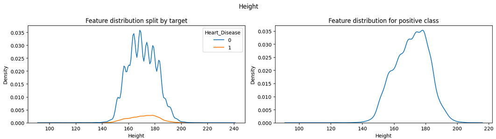
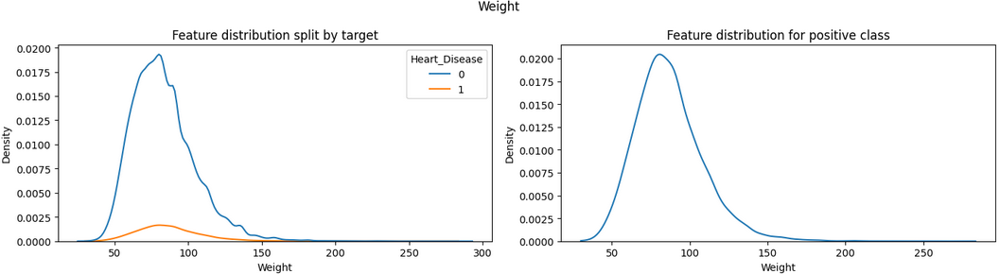
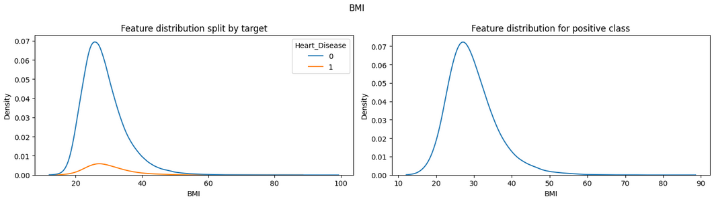
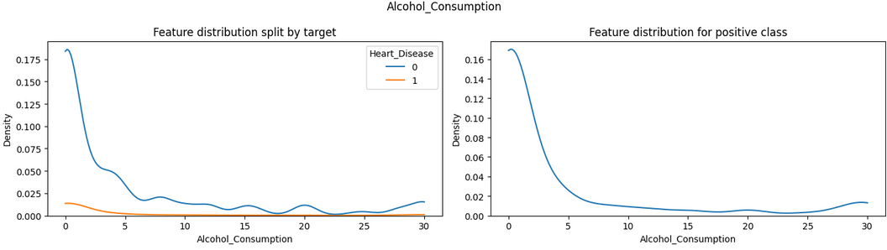
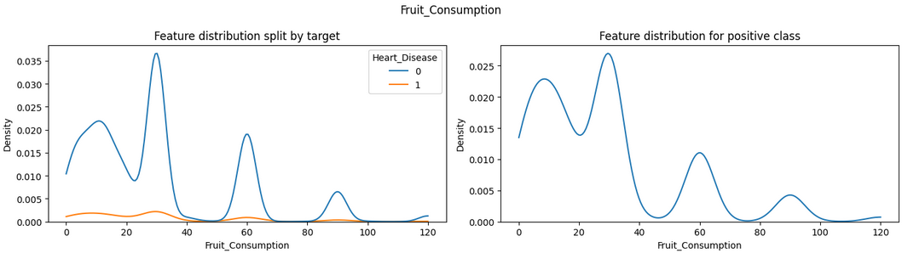
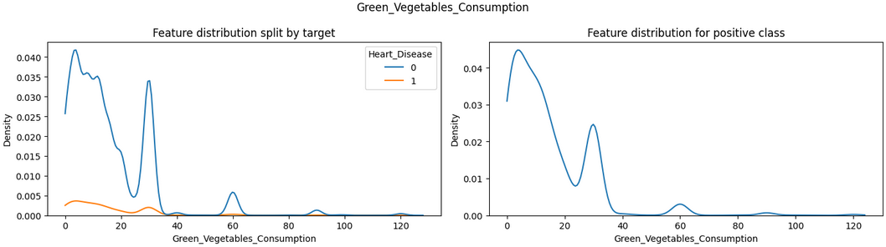
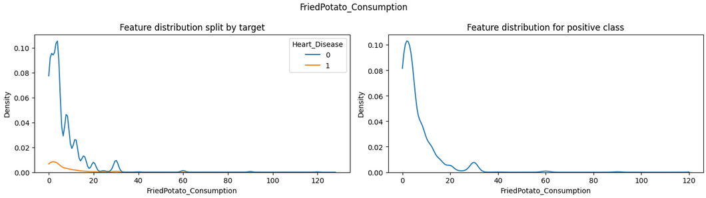

**Correlations**:  
Pearson:

Spearman's rank:

Kendall-Tau:
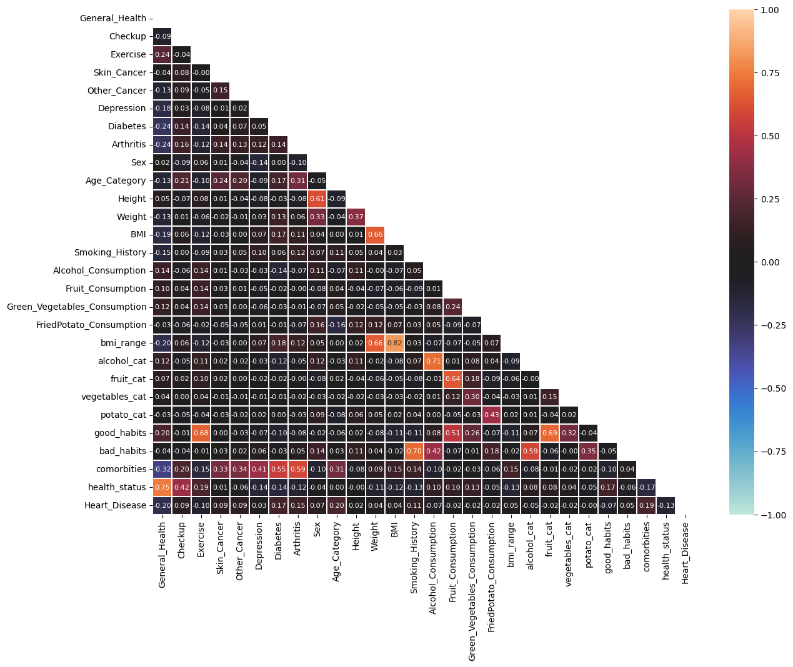

### MODELS USED AND THEIR ACCURACIES

| Model + Feature set | Accuracy (%) | Recall (%) |
|-------|----------|-----|
| Logistic Regression + Original | 76.29 | 74.21 |
| Logistic Regression + Extended | 76.27 | 74.41 |
| Logistic Regression + Selected | 72.66 | 78.09 |
| Decision Tree + Original | 72.76 | 78.61 |
| Decision Tree + Extended | 74.09 | 76.69 |
| Decision Tree + Selected | 75.52 | 73.61 |
| Random Forest + Original | 73.97 | 77.33 |
| Random Forest + Extended | 74.10 | 76.61 |
| Random Forest + Selected | 74.80 | 74.05 |
| AdaBoost + Original | 76.03 | 74.49 |
| AdaBoost + Extended | 74.99 | 76.25 |
| AdaBoost + Selected | 74.76 | 75.33 |
| Multi-Layer Perceptron + Original | **76.91** | 72.81 |
| **Multi-Layer Perceptron + Extended** | 73.26 | **79.01** |
| Multi-Layer Perceptron + Selected | 74.86 | 75.05 |
| Hist-Gradient Boosting + Original | 75.98 | 73.49 |
| Hist-Gradient Boosting + Extended | 75.63 | 74.73 |
| Hist-Gradient Boosting + Selected | 74.40 | 75.85 |

### MODELS COMPARISON GRAPHS

* **Logistic Regression**:  
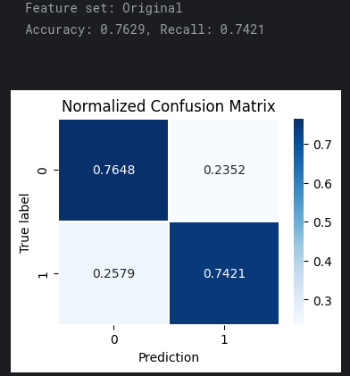 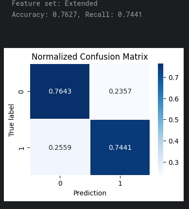 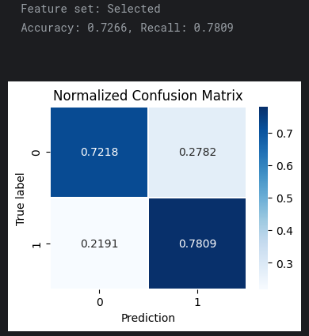

* **Decision Tree**:  
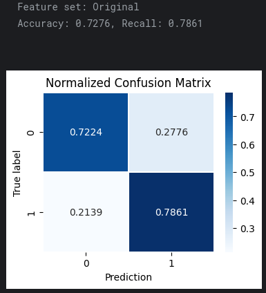 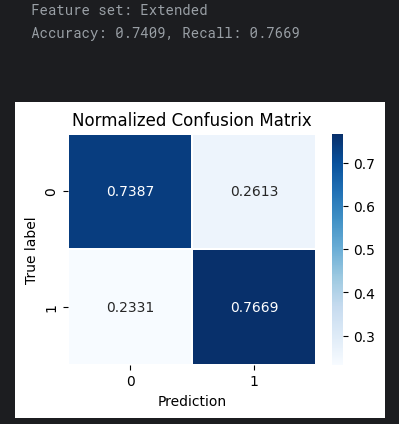 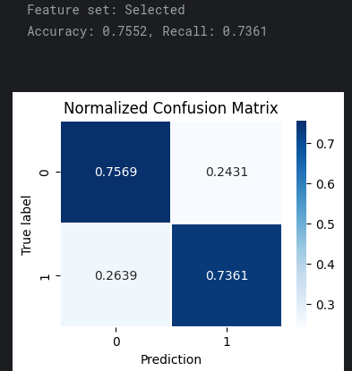

* **Random Forest**:  
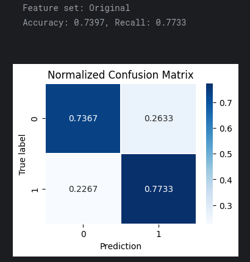 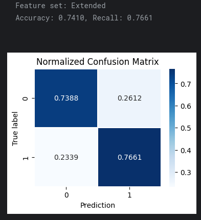 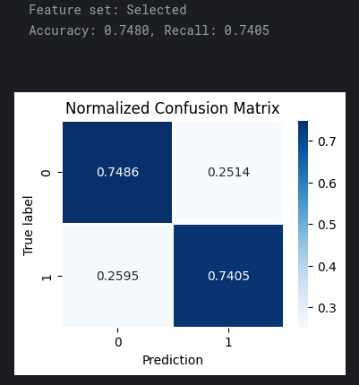

* **AdaBoost**:  
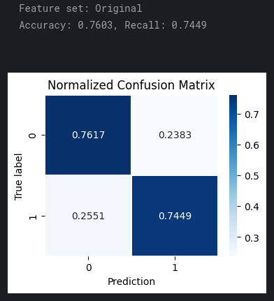 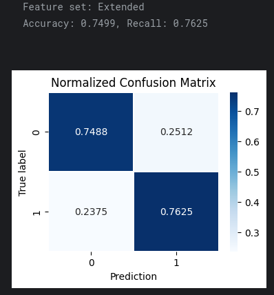 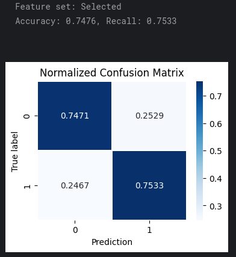

* **Multi-Layer Perceptron**:  
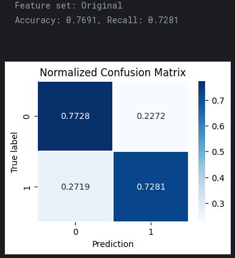 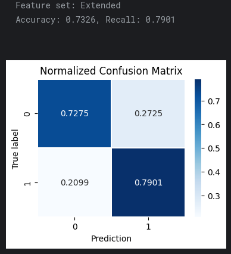 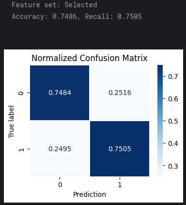

* **Hist-Gradient Boosting**:  
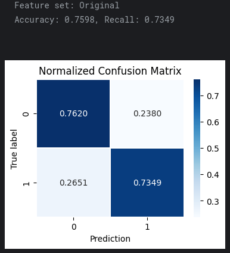 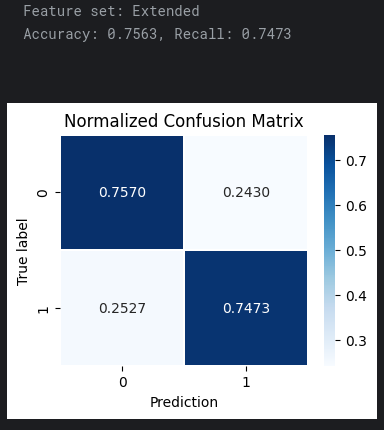 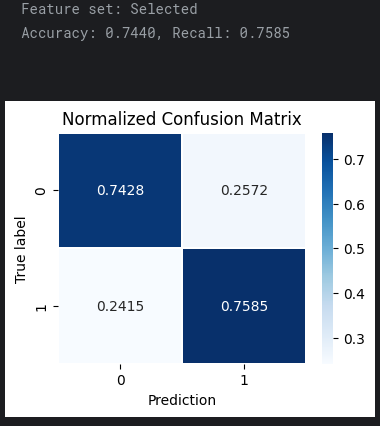

## CONCLUSION

### WHAT YOU HAVE LEARNED

* Insights gained from the data:  
General Health, Age and Co-morbities (such as Diabetes & Arthritis) are the most indicative features for CVD risk.
* Improvements in understanding machine learning concepts:  
Learned and implemented the concept of predicting probability and tuning the prediction threshold for more accurate results, compared to directly predicting with the default thresold for models.
* Challenges faced and how they were overcome:
Deciding the correct metric for evaluation of models due to imbalanced nature of the dataset. Since positive class is more important, Recall was used as the final metric for ranking models. F2-score was used to tune the threshold for models to maintain a balance between precision and recall, thereby maintaining overall accuracy.

### USE CASES OF THIS MODEL

1. Doctors can use it as a second opinion when assessing a new patient. Model trained on cases from previous patients can be used to predict the risk.
2. People (patients in particular) can use this tool to track the risk of CVD based on their own lifestyle factors and take preventive measures when the risk is high.

### HOW TO INTEGRATE THIS MODEL IN REAL WORLD

* The model uses data based on lifestyle factors without using any private identifiers.
* A simple web interface using Streamlit can be used to input required data from the user.
* Input data is preprocessed according to the steps taken before model training and the extended features are created.
* Best model from the experiments i.e., "Multi-Layer Perceptron + Extended features" can be exported as a joblib file and loaded into Streamlit interface for inference.
* Results on new data can be stored to monitor if the model maintains high recall, as intended in the experiments.

### FEATURES PLANNED BUT NOT IMPLEMENTED

* Different implementations of gradient-boosting models such as XGBoost, CatBoost, LightGBM, etc. were not implemented since none of the tree ensemble models such as Random Forest, AdaBoost or Hist-Gradient Boosting were among the best performers. Hence, avoid additional dependencies based on such models.

### NAME

**Siddhant Tiwari**

#### Happy Coding 🧑‍💻

### Show some &nbsp;❤️&nbsp; by &nbsp;🌟&nbsp; this repository!
