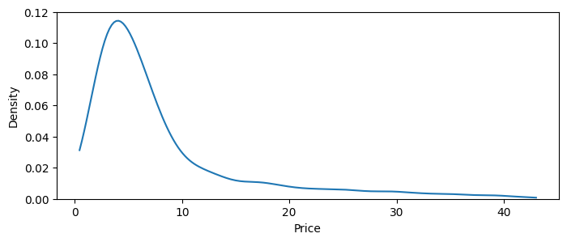
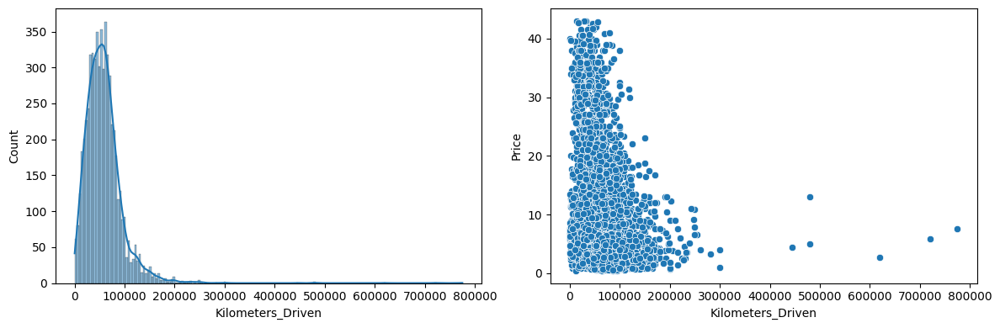
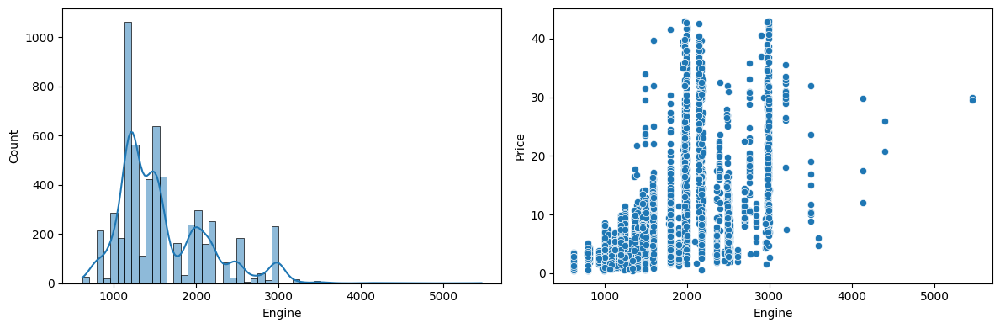
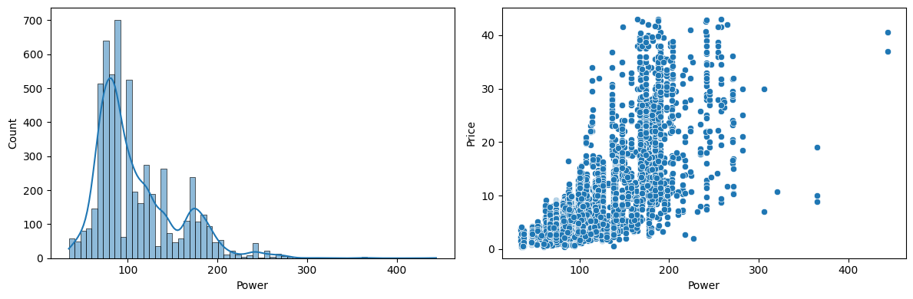
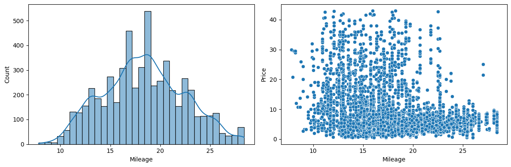
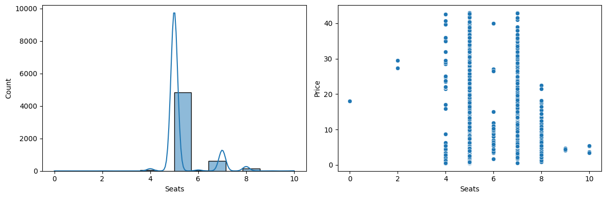
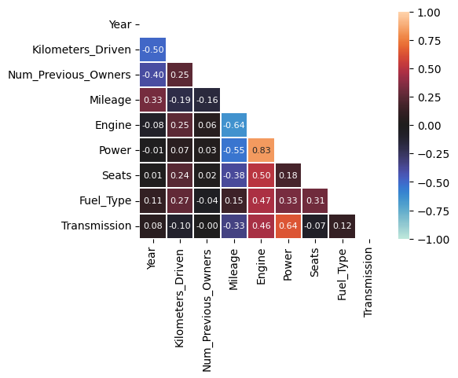
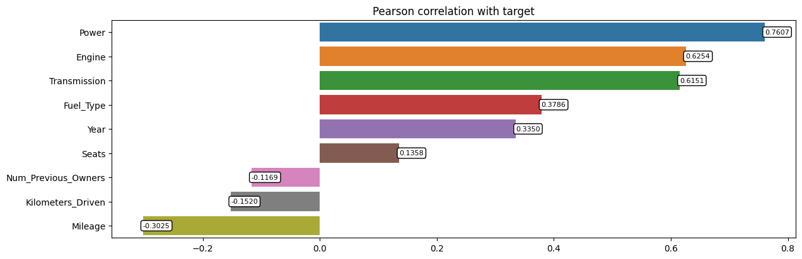
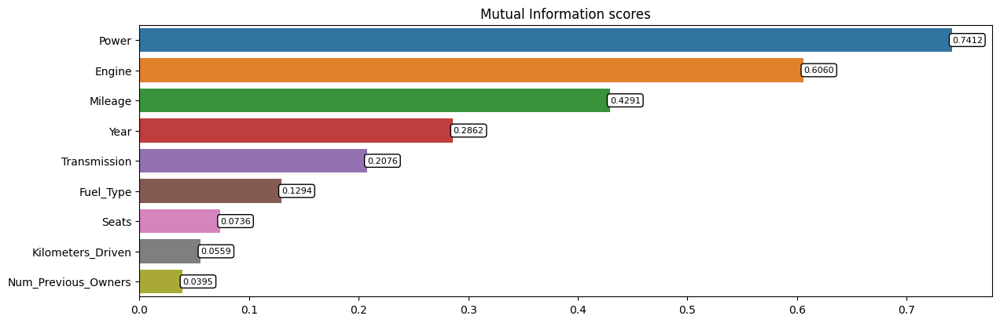

# Used Cars Price Prediction

## AIM

Predicting the prices of used cars based on their configuration and previous usage.

## DATASET LINK

[Used Cars Price Prediction Dataset - Kaggle](https://www.kaggle.com/datasets/avikasliwal/used-cars-price-prediction)

## MY NOTEBOOK LINK

[Used Cars Price Prediction](https://www.kaggle.com/code/sid4ds/used-cars-price-prediction/)

## DESCRIPTION

* Why is the project necessary?  
This project aims to predict the prices of used cars listed on an online marketplace based on their features and usage by previous owners. This model can be used by sellers to estimate an approximate price for their cars when they list them on the marketplace. Buyers can use the model to check if the listed price is fair when they decide to buy a used vehicle.

* How did you start approaching this project? (Initial thoughts and planning)
  * Researching previous projects and articles related to the problem.
  * Data exploration to understand the features.  
    Identifying different preprocessing strategies for different feature types.
  * Choosing key metrics for the problem - Root Mean Squared Error (for error estimation), R2-Score (for model explainability)

* Mention any additional resources used (blogs, books, chapters, articles, research papers, etc.).
  * [Dealing with features that have high cardinality](https://towardsdatascience.com/dealing-with-features-that-have-high-cardinality-1c9212d7ff1b)
  * [Target-encoding Categorical Variables](https://towardsdatascience.com/dealing-with-categorical-variables-by-using-target-encoder-a0f1733a4c69)
  * [Cars Price Prediction](https://www.kaggle.com/code/khotijahs1/cars-price-prediction)

## EXPLANATION

### DETAILS OF THE DIFFERENT FEATURES

1. Name: car model
2. Location: city where the car is listed for sale
3. Year: year of original purchase of car
4. Kilometers_Driven: odometer reading of the car
5. Fuel_Type: fuel type of the car - petrol, diesel, CNG, etc.
6. Transmission: transmission type of the car - automatic vs manual
7. Owner_Type: number of previous owners of the car
8. Mileage: current mileage (distance per unit of fuel) provided by the car
9. Engine: engine capacity of the car in CC
10. Power: engine power output in BHP
11. Seats: seating capacity of the car
12. New_Price: original price of the car at the time of purchase

### WHAT I HAVE DONE

1. **Exploratory Data Analysis**:
   * Summary statistics
   * Data visualization for numerical feature distributions
   * Target splits for categorical features
2. **Data cleaning and Preprocessing**:
   * Removing rare categories of brands
   * Removing outliers for numerical features and target
   * Categorical feature encoding for low-cardinality features
   * Target encoding for high-cardinality categorical features (in model pipeline)
3. **Feature engineering and selection**:
   * Extracting brand name from model name for a lower-cardinality feature.
   * Converting categorical Owner_Type to numerical Num_Previous_Owners.
   * Feature selection based on model-based feature importances and statistical tests.
4. **Modeling**:
   * Holdout dataset created for model testing
   * Setting up a framework for easier testing of multiple models.
   * Models trained: LLinear Regression, K-Nearest Neighbors, Decision Tree, Random Forest, AdaBoost, Multi-Layer Perceptron, XGBoost and CatBoost.
   * Models were ensembled using Simple and Weighted averaging.
5. **Result analysis**:
    * Predictions made on holdout test set
    * Models compared based on chosen metrics: RMSE and R2-Score.
    * Visualized predicted prices vs actual prices to analyze errors.

### PROJECT TRADE-OFFS AND SOLUTIONS

**Training time & Model complexity vs Reducing error**  

* Solution: Limiting depth and number of estimators for tree-based models. Overfitting detection and early stopping mechanism for neural network training.

### LIBRARIES NEEDED

Libraries required for the project:

* pandas
* numpy
* scikit-learn (>=1.5.0 required for Target Encoding)
* xgboost
* catboost
* matplotlib
* seaborn

### SCREENSHOTS

**Data exploration**:  
  
  
  
  
  
  
  

**Feature selection**:  
Feature correlation:  
  
Target correlation:  
  
Mutual information:  
  

### MODELS USED AND THEIR PERFORMANCE

| Model | RMSE | R2-Score
|:-----|:-----:|:-----:
| Linear Regression | 3.5803 | 0.7915  
| K-Nearest Neighbors | 2.8261 | 0.8701  
| Decision Tree | 2.6790 | 0.8833  
| Random Forest | 2.4619 | 0.9014  
| AdaBoost | 2.3629 | 0.9092  
| Multi-layer Perceptron | 2.6255 | 0.8879  
| XGBoost w/o preprocessing | 2.1649 | 0.9238  
| **XGBoost with preprocessing** | **2.0987** | **0.9284**  
| CatBoost w/o preprocessing | 2.1734 | 0.9232  
| Simple average ensemble | 2.2804 | 0.9154  
| Weighted average ensemble | 2.1296 | 0.9262  

## CONCLUSION

### WHAT YOU HAVE LEARNED

* Insights gained from the data:

1. Features related to car configuration such as Power, Engine and Transmission are some of the most informative features. Usage-related features such as Year and current Mileage are also important.
2. Seating capacity and Number of previous owners had relatively less predictive power. However, none of the features were candidates for removal.

* Improvements in understanding machine learning concepts:  

1. Implemented target-encoding for high-cardinality categorical features.
2. Designed pipelines to avoid data leakage.
3. Ensembling models using prediction averaging.

* Challenges faced:

1. Handling mixed feature types in preprocessing pipelines.
2. Regularization and overfitting detection to reduce training time while maintaining performance.

### USE CASES OF THIS MODEL

* Sellers can use the model to estimate an approximate price for their cars when they list them on the marketplace.
* Buyers can use the model to check if the listed price is fair when they decide to buy a used vehicle.

### HOW TO INTEGRATE THIS MODEL IN REAL WORLD

* The model can be used without any private identifiers.
* Input data is preprocessed according to the steps taken before model training and the extended features are created.
* The best model: *XGBoost with Preprocessing* can be used for inference.
* Results on new data can be stored to monitor if the model maintains performance level. Once a significant number of sale transactions have been processed, system can be evaluated for model-drift and retrained if required.

### FEATURES PLANNED BUT NOT IMPLEMENTED

* Complex model-ensembling through stacking or hill-climbing was not implemented due to significantly longer training time.

### NAME

**Siddhant Tiwari**

#### Happy Coding 🧑‍💻

### Show some &nbsp;❤️&nbsp; by &nbsp;🌟&nbsp; this repository!
