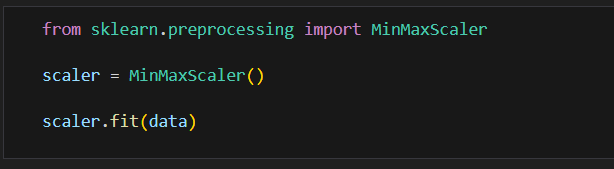
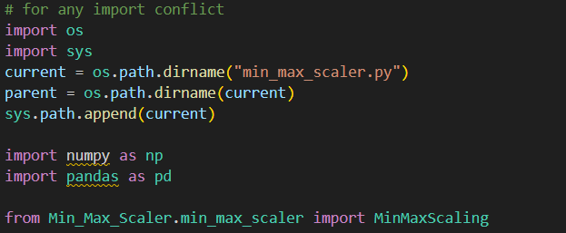
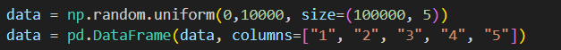
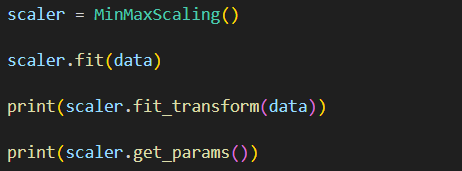
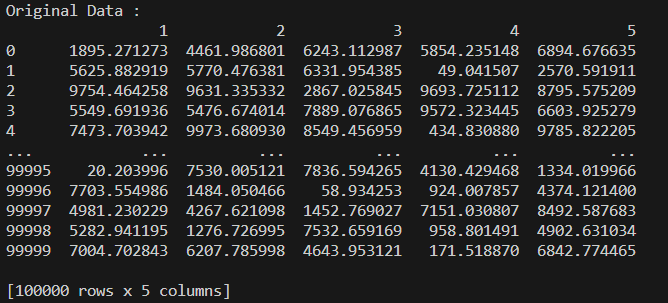
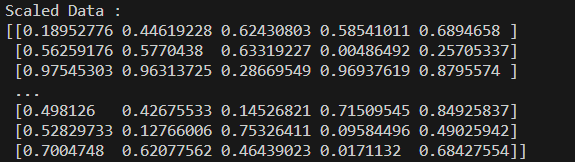
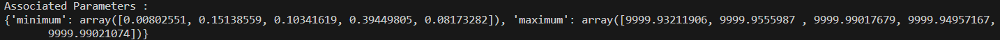

# MinMaxScaling

`MinMaxScaling` is a custom implementation of feature scaling that normalizes features to a given range, typically [0, 1]. This is similar to the `MinMaxScaler` in `scikit-learn`.



## Features

- **Normalization**: Transforms data to fit within a specified range, typically [0, 1].
- **Data Type Compatibility**: Works with both pandas DataFrames and NumPy arrays.
- **Parameter Handling**: Allows getting and setting custom minimum and maximum values.
- **Exception Handling**: Includes basic exception handling for null values and incorrect data types.

## Methods

- `check_type(data)`: Checks and converts data type to NumPy array if it is a pandas DataFrame.
- `fit(data)`: Computes the minimum and maximum values of the data.
- `fit_transform(data)`: Fits the data and then transforms it.
- `transform(data)`: Transforms the data using previously computed minimum and maximum values.
- `get_params()`: Returns the minimum and maximum values.
- `set_params(min, max)`: Sets custom minimum and maximum values.

## Exception Handling

The class includes basic exception handling:
- Raises an exception if input data contains null values.
- Raises an exception if data type is not a pandas DataFrame or NumPy array.
- Prints an error message if transformation is attempted before fitting the scaler.

## Installation

This implementation is a standalone Python class and does not require any specific installation. However, you need to have `numpy` and `pandas` installed in your environment.
Just run these command in the Algorithms directory
 - First, create a virtual environment. For that, ```virtualenv``` module is required.
   ```
   pip install virtualenv
   ```
   Then to create a virtual environement:
   ```
   virtualenv <environment_name>
   ```
   This creates a virtual environment inside Algorithms directory, which then needs to be activated
   ```
   py <environment_name>/Scripts/activate_this.py
   ```
 - Secondly, install all the required libraries
   ```
   pip install -r requirements.txt
   ```

## Testing

1. Load all the required libraries and Custom MinMaxScaling class



2. Create a custom data frame 



3. Create a MinMaxScaling Class's object and call the desired functions



## Outputs







### Notes
1. **Ensure the class definition is available**: Include the `MinMaxScaling` class in your script or save it in a module (e.g., `your_module.py`) and import it accordingly.
2. **Adjust paths**: Make sure to adjust the import path if you save the class in a different module.
3. **License**: Replace the placeholder in the License section with the actual license text or file link.

This README provides a comprehensive overview of the `MinMaxScaling` class, including its features, usage examples, and how to handle potential issues.