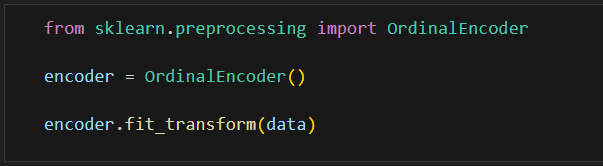
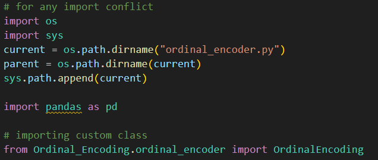
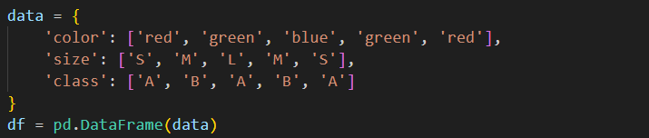
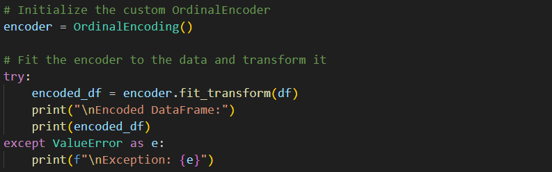
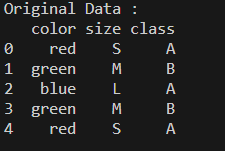
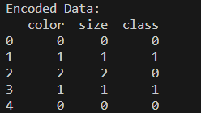

# OrdinalEncoding

`OrdinalEncoding` is a custom implementation of ordinal encoding for categorical variables. It assigns a unique integer value to each category, preserving the ordinal relationship if present.



## Features

- **Null Check**: Provides a null check function to ensure input data does not contain null values before encoding.
- **Fit Function**: Computes category mappings for each column based on unique values.
- **Transform Function**: Transforms categorical variables into encoded integers using the computed mappings.
- **Fit Transform**: Combines the fit and transform steps into a single method.

## Methods

- `null_check(data)`: Checks for null values in the input data.
- `fit(data)`: Computes category mappings for each column based on unique values.
- `transform(data)`: Transforms categorical variables into encoded integers using the computed mappings.
- `fit_transform(data)`: Combines the fit and transform steps into a single method.

## Exception Handling

The class includes basic exception handling:
- Raises a ValueError if input data contains null values.

## Installation

This implementation is a standalone Python class and does not require any specific installation. However, you need to have `numpy` and `pandas` installed in your environment.
Just run these command in the Algorithms directory
 - First, create a virtual environment. For that, ```virtualenv``` module is required.
   ```
   pip install virtualenv
   ```
   Then to create a virtual environement:
   ```
   virtualenv <environment_name>
   ```
   This creates a virtual environment inside Algorithms directory, which then needs to be activated
   ```
   py <environment_name>/Scripts/activate_this.py
   ```
 - Secondly, install all the required libraries
   ```
   pip install -r requirements.txt
   ```

## Testing

1. Load all the required libraries and Custom OrdinalEncoding class



2. Create a custom data frame 



3. Create a OrdinalEncoding Class's object and call the desired functions



## Outputs





### Notes
1. **Ensure the class definition is available**: Include the `OrdinalEncoding` class in your script or save it in a module (e.g., `your_module.py`) and import it accordingly.
2. **Adjust paths**: Make sure to adjust the import path if you save the class in a different module.
3. **License**: Replace the placeholder in the License section with the actual license text or file link.

This README provides a comprehensive overview of the `OrdinalEncoding` class, including its features, usage examples, and how to handle potential issues.