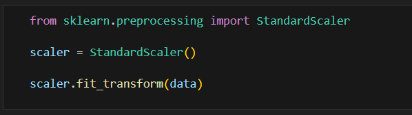
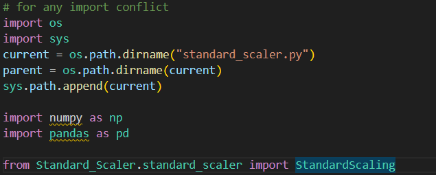
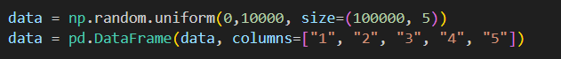
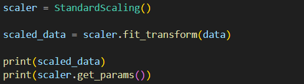
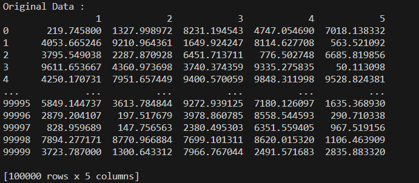
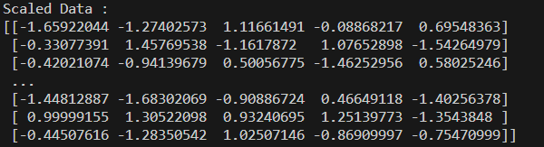
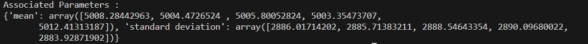

# **STANDARD SCALER**

The `StandardScaler` is a feature scaling method in machine learning provided by the `scikit-learn` library in Python. It standardizes features by removing the mean and scaling to unit variance. Specifically, it transforms the data so that the distribution has a mean of 0 and a standard deviation of 1.



### **MATHEMATICAL INTUITION**

Standardization formula : 
 - Standardized_feature_value = (Original_feature_value - mean_of_the_feature) / Standard_deviation_of_the_feature

Purpose :
 - Ensures that each feature contributes equally to the model.
 - Improves the performance and convergence speed of many machine learning algorithms that rely on distance calculations (e.g., linear regression, logistic regression, k-nearest neighbors).

### **Creating Custom Standard Scaler**

## Features

- **Standardization**: Transform data to have a mean of 0 and standard deviation of 1.
- **Data Type Compatibility**: Works with both pandas DataFrames and NumPy arrays.
- **Parameter Handling**: Allows getting and setting custom mean and standard deviation values.
- **Exception Handling**: Includes basic exception handling for null values and incorrect data types.

## Methods

- `check_type(data)`: Checks and converts data type to NumPy array if it is a pandas DataFrame.
- `fit(data)`: Computes the mean and standard deviation of the data.
- `fit_transform(data)`: Fits the data and then transforms it.
- `transform(data)`: Transforms the data using previously computed mean and standard deviation.
- `get_params()`: Returns the mean and standard deviation.
- `set_params(mean, std)`: Sets custom mean and standard deviation.

## Exception Handling

The class includes basic exception handling:
- Raises an exception if input data contains null values.
- Raises an exception if data type is not a pandas DataFrame or NumPy array.
- Prints an error message if transformation is attempted before fitting the scaler.

## Installation

This implementation is a standalone Python class and does not require any specific installation. However, you need to have `numpy` and `pandas` installed in your environment.
Just run these command in the Algorithms directory
 - First, create a virtual environment. For that, ```virtualenv``` module is required.
   ```pip install virtualenv```
   Then to create a virtual environement:
   ```virtualenv <environment_name>```
   This creates a virtual environment inside Algorithms directory, which then needs to be activated
   ```py <environment_name>/Scripts/activate_this.py```
 - Secondly, install all the required libraries
   ```pip install -r requirements.txt```

## Testing

1. Load all the required libraries and Custom StandardScaling class



2. Create a custom data frame 



3. Create a StandardScaling Class's object and call the desired functions



## Outputs







### Notes
1. **Ensure the class definition is available**: Include the `StandardScaling` class in your script or save it in a module (e.g., `your_module.py`) and import it accordingly.
2. **Adjust paths**: Make sure to adjust the import path if you save the class in a different module.
3. **License**: Replace the placeholder in the License section with the actual license text or file link.

This README provides a comprehensive overview of the `StandardScaling` class, including its features, usage examples, and how to handle potential issues.