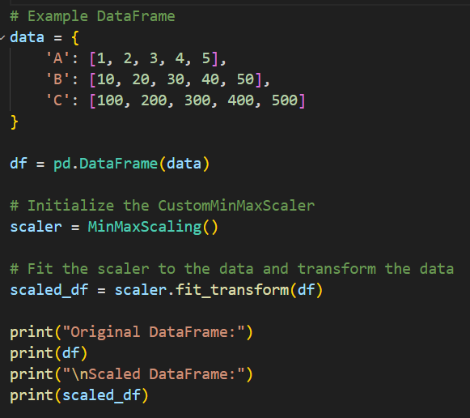

# MinMaxScaler

A custom implementation of a MinMaxScaler class for scaling numerical data in a pandas DataFrame. The class scales the features to a specified range, typically between 0 and 1.

## Features

- **fit**: Calculate the minimum and maximum values of the data.
- **transform**: Scale the data to the specified feature range.
- **fit_transform**: Fit the scaler and transform the data in one step.
- **get_params**: Retrieve the minimum and maximum values calculated during fitting.

## Methods

1. `__init__(self, feature_range=(0, 1))`
    - Initializes the MinMaxScaling class.
    - Parameters:
        - feature_range (tuple): Desired range of transformed data. Default is (0, 1).
2. `fit(self, data)`
    - Calculates the minimum and maximum values of the data.
    - Parameters:
        - data (pandas.DataFrame): The data to fit.
3. `transform(self, data)`
    - Transforms the data to the specified feature range.
    - Parameters:
        - data (pandas.DataFrame): The data to transform.
    - Returns:
        - pandas.DataFrame: The scaled data.
4. `fit_transform(self, data)`
    - Fits the scaler to the data and transforms the data in one step.
    - Parameters:
        - data (pandas.DataFrame): The data to fit and transform.
    - Returns:
        - pandas.DataFrame: The scaled data.
5. `get_params(self)`
    - Retrieves the minimum and maximum values calculated during fitting.
    - Returns:
        - dict: Dictionary containing the minimum and maximum values.

## Error Handling

- Raises a TypeError if the input data is not a pandas DataFrame in the fit method.
- Raises an error if transform is called before fit or fit_transform.
- Raises an error in get_params if called before fit.

## Use Case

## Output

## Installation

No special installation is required. Just ensure you have `pandas` installed in your Python environment.
