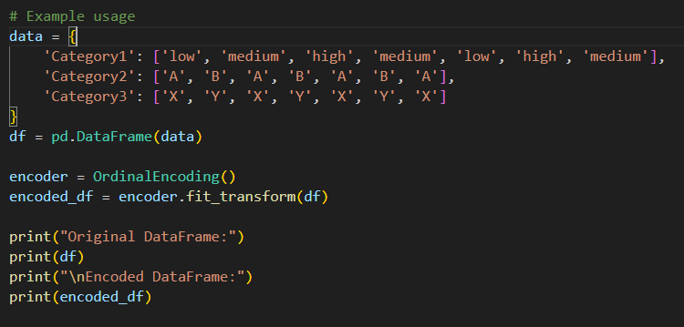
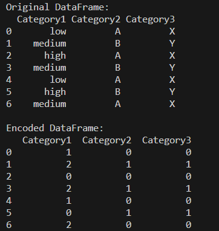

# OrdinalEncoder

A custom implementation of an OrdinalEncoder class for encoding categorical data into ordinal integers using a pandas DataFrame. The class maps each unique category to an integer based on the order of appearance.

## Features

- **fit**: Learn the mapping of categories to ordinal integers for each column.
- **transform**: Transform the categorical data to ordinal integers based on the learned mapping.
- **fit_transform**: Fit the encoder and transform the data in one step.

## Methods

1. `__init__(self)`
    - Initializes the OrdinalEncoding class.
    - No parameters are required.
2. `fit(self, data)`
    - Learns the mapping of categories to ordinal integers for each column.
    - Parameters:
        - data (pandas.DataFrame): The data to fit.
    - Raises:
        - TypeError: If the input data is not a pandas DataFrame.
3. `transform(self, data)`
    - Transforms the categorical data to ordinal integers based on the learned mapping.
    - Parameters:
        - data (pandas.DataFrame): The data to transform.
    - Returns:
        - pandas.DataFrame: The transformed data.
    - Raises:
        - Error: If transform is called before fit or fit_transform.
4. `fit_transform(self, data)`
    - Fits the encoder to the data and transforms the data in one step.
    - Parameters:
        - data (pandas.DataFrame): The data to fit and transform.
    - Returns:
        - pandas.DataFrame: The transformed data.

## Error Handling

- Raises a TypeError if the input data is not a pandas DataFrame in the fit method.
- Raises an error if transform is called before fit or fit_transform.

## Use Case

## Output

## Installation

No special installation is required. Just ensure you have `pandas` installed in your Python environment.