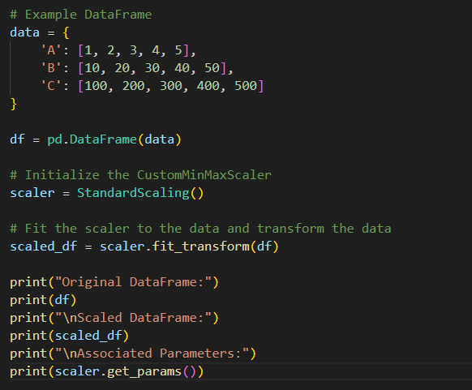
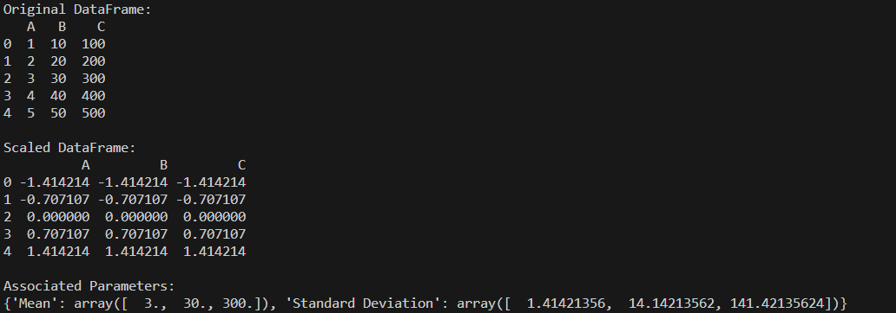

# StandardScaler

A custom implementation of a StandardScaler class for scaling numerical data in a pandas DataFrame or NumPy array. The class scales the features to have zero mean and unit variance.

## Features

- **fit**: Calculate the mean and standard deviation of the data.
- **transform**: Scale the data to have zero mean and unit variance.
- **fit_transform**: Fit the scaler and transform the data in one step.
- **get_params**: Retrieve the mean and standard deviation calculated during fitting.

## Methods

1. `__init__(self)`
    - Initializes the StandardScaling class.
    - No parameters are required.
2. `fit(self, data)`
    - Calculates the mean and standard deviation of the data.
    - Parameters:
        - data (pandas.DataFrame or numpy.ndarray): The data to fit.
    - Raises:
        - TypeError: If the input data is not a pandas DataFrame or NumPy array.
3. `transform(self, data)`
    - Transforms the data to have zero mean and unit variance.
    - Parameters:
        - data (pandas.DataFrame or numpy.ndarray): The data to transform.
    - Returns:
        - numpy.ndarray: The scaled data.
    - Raises:
        - Error: If transform is called before fit or fit_transform.
4. `fit_transform(self, data)`
    - Fits the scaler to the data and transforms the data in one step.
    - Parameters:
        - data (pandas.DataFrame or numpy.ndarray): The data to fit and transform.
    - Returns:
        - numpy.ndarray: The scaled data.
5. `get_params(self)`
    - Retrieves the mean and standard deviation calculated during fitting.
    - Returns:
        - dict: Dictionary containing the mean and standard deviation.
    - Raises:
        - Error: If get_params is called before fit.

## Error Handling

- Raises a TypeError if the input data is not a pandas DataFrame or NumPy array in the fit method.
- Raises an error if transform is called before fit or fit_transform.
- Raises an error in get_params if called before fit.

## Use Case

## Output

## Installation

No special installation is required. Just ensure you have `pandas` and `numpy` installed in your Python environment.