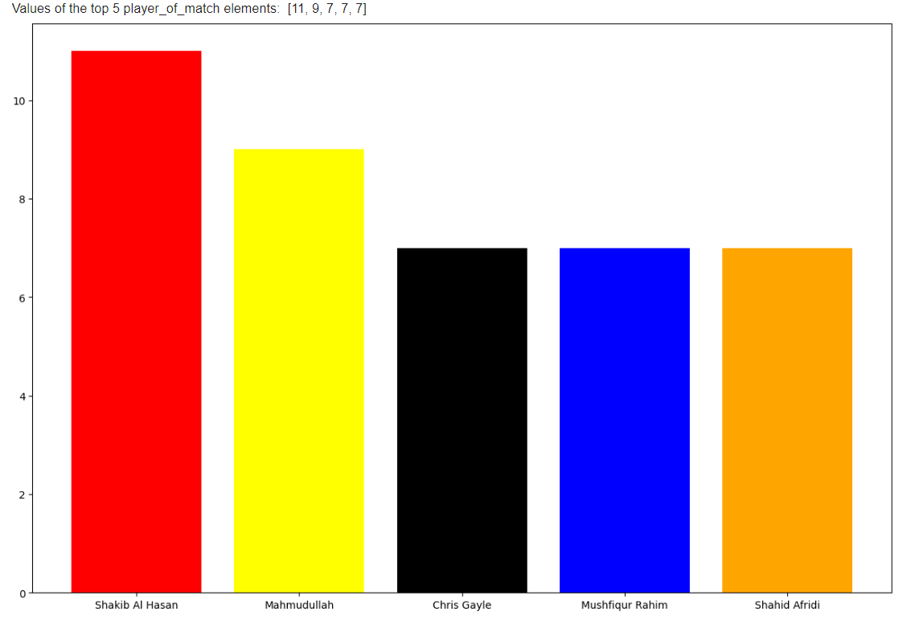
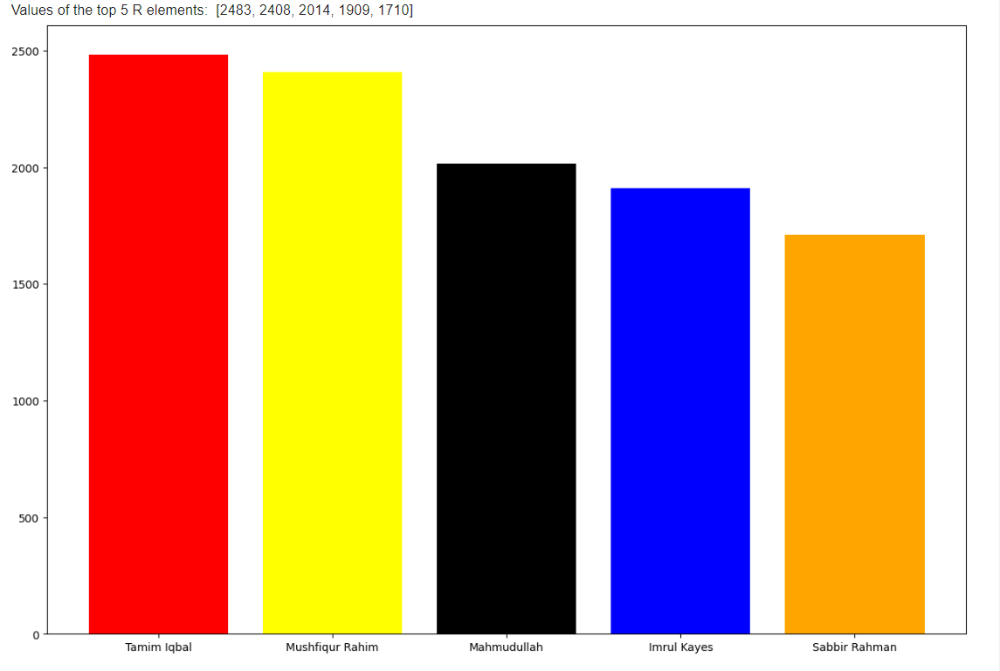
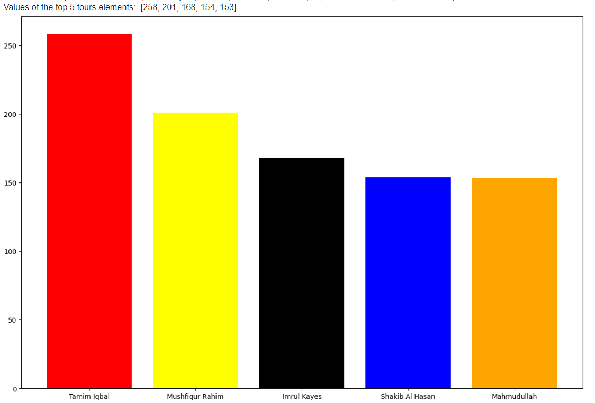
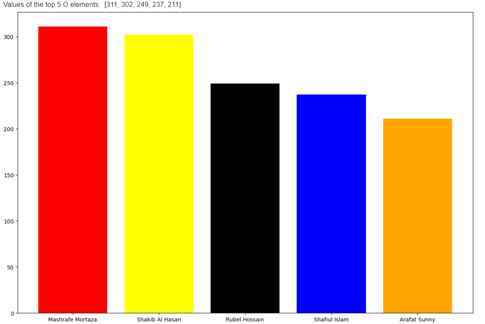
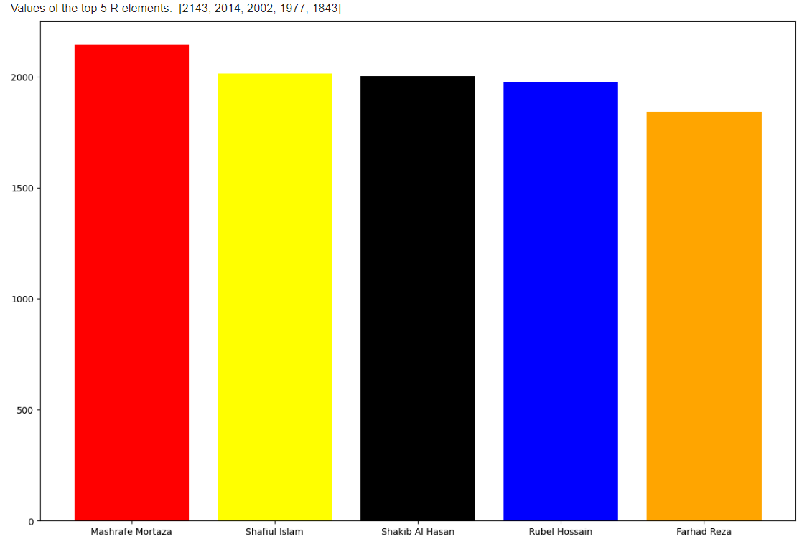
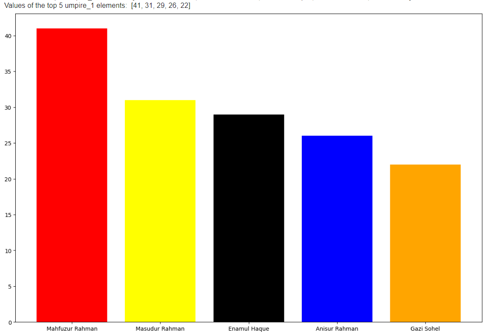
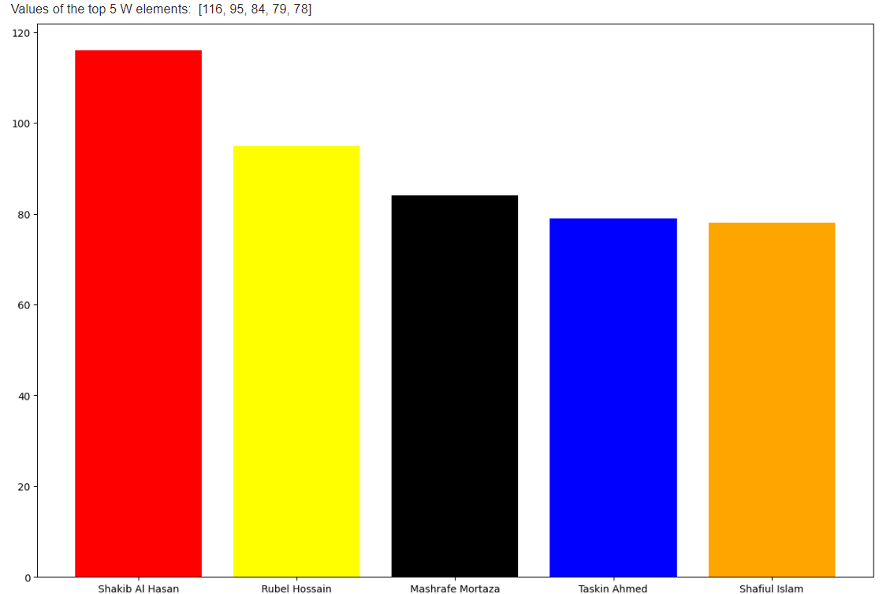
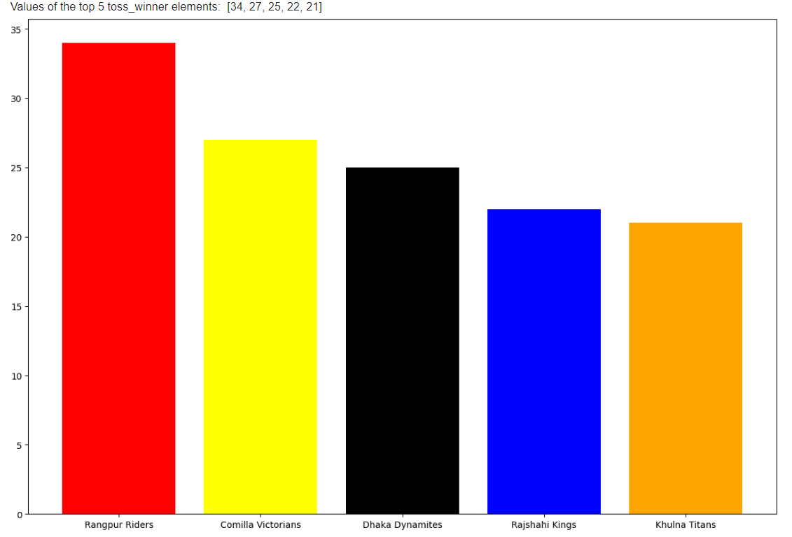
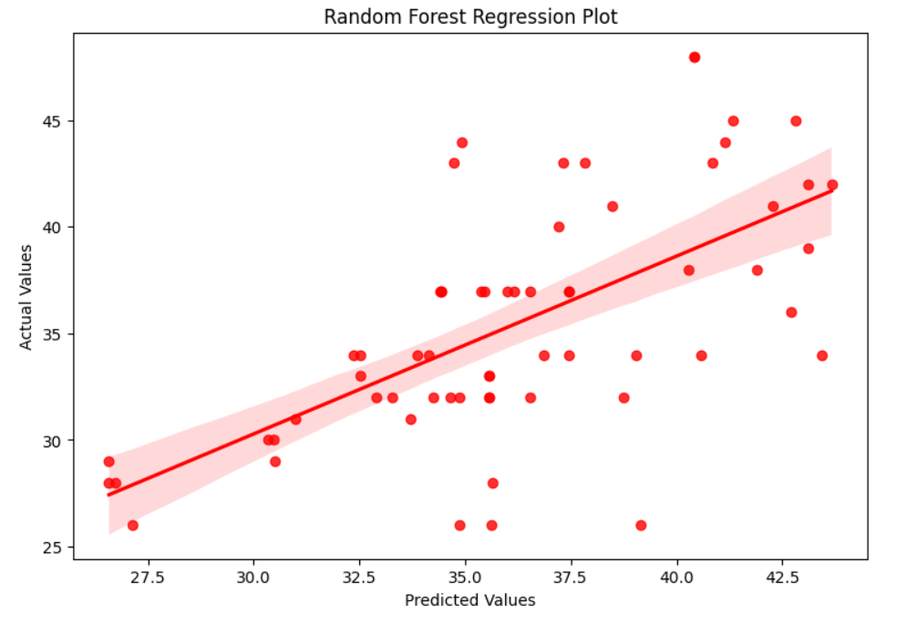
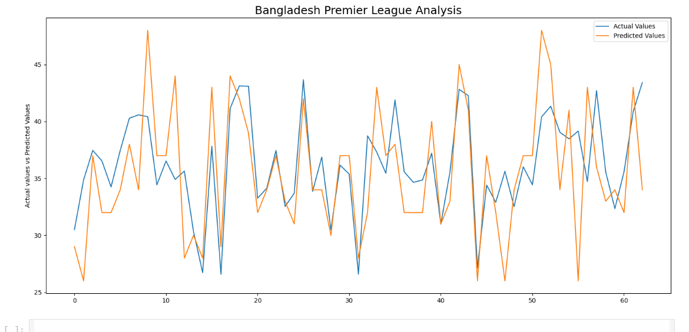

# Bangladesh Premier League Analysis 

## AIM
<!-- In 1 single line -->
The main goal of the project is to analyze the performance of the bangladesh players in their premier league and obtaining the top 5 players in all of them in different fields like bowling, batting, toss_winner, highest runner, man of the match, etc.

## DATASET LINK
<!-- Attach the link of the Dataset -->
https://www.kaggle.com/abdunnoor11/bpl-data

## MY NOTEBOOK LINK
<!-- Mention your notebook link where you have solve it either on Kaggle or Collab Link or Drive Link. -->
https://colab.research.google.com/drive/1equud2jwKnmE1qbbTJLsi2BbjuA7B1Si?usp=sharing

## DESCRIPTION
<!-- Properly describe the project. Provide the answer of all the questions,
what is the requirement of the project?, 
why is it necessary?, 
how is it beneficial and used?, 
how did you start approaching this project?, 
Any additional resources used like blogs reading, books reading (mention the name of book along with the pages you have read)?
etc. -->
- What is the requirement of the project?
  - This project aims to analyze player performance data from the Bangladesh Premier League (BPL) to classify players into categories such as best, good, average, and poor based on their performance.
  - The analysis provides valuable insights for players and coaches, highlighting who needs more training and who requires less, which can aid in strategic planning for future matches.

- Why is it necessary?
  - Analyzing player performance helps in understanding strengths and weaknesses, which can significantly reduce the chances of losing and increase the chances of winning future matches.
  - It aids in making informed decisions about team selection and match strategies.

- How is it beneficial and used?
  - **For Players:** Provides feedback on their performance, helping them to improve specific aspects of their game.
  - **For Coaches:** Helps in identifying areas where players need improvement, which can be focused on during training sessions.
  - **For Team Management:** Assists in strategic decision-making regarding player selection and match planning.
  - **For Fans and Analysts:** Offers insights into player performances and trends over the league, enhancing the understanding and enjoyment of the game.

- How did you start approaching this project? (Initial thoughts and planning)
  - Perform initial data exploration to understand the structure and contents of the dataset.
  - To learn about the topic and searching the related content like `what is league`, `About bangladesh league`, `their players` and much more.
  - Learn about the features in details by searching on the google or quora.

- Mention any additional resources used (blogs, books, chapters, articles, research papers, etc.).
  - Articles on cricket analytics from websites such as ESPNcricinfo and Cricbuzz.
  - https://www.linkedin.com/pulse/premier-league-202223-data-analysis-part-i-ayomide-aremu-cole-iwn4e/
  - https://analyisport.com/insights/how-is-data-used-in-the-premier-league/

## EXPLANATION

### DETAILS OF THE DIFFERENT FEATURES
<!-- Elaborate the features as mentioned in the issues, perfoming any googling to learn about the features -->
There are 3 different types of the datasets.

- Batsman Dataset
- Bowler Dataset
- BPL (Bangladesh Premier League) Dataset

There are 12 features in `Batsman Dataset`

| Feature Name | Description|
|--------------|------------|
| id | All matches unique id |
| season | Season |
| match_no | Number of matches |
| date | Date of Play |
| player_name | Player Name |
| comment | How did the batsman get out? |
| R | Batsman's run |
| B | How many balls faced the batsman? |
| M | How long their innings was in minutes? |
| fours | Fours |
| sixs | Sixes |
| SR | Strike rate |

There are 12 features in `Bowler Dataset`

| Feature Name | Description|
|--------------|------------|
| id | All matches unique id |
| season | Season |
| match_no | Number of matches |
| date | Date of Play |
| player_name | Player Name |
| O | Overs |
| M | middle overs |
| R | Runs |
| W | Wickets |
| ECON | The average number of runs they have conceded per over bowled |
| WD | Wide balls |
| NB | No balls |

There are 19 features in `BPL Dataset`

| Feature Name | Description|
|--------------|------------|
| id | All matches unique id |
| season | Season |
| match_no | Number of matches |
| date | Date of Play |
| team_1 | First Team |
| team_1_score | First Team Score |
| team_2 | Second Team |
| team_2_score | Second Team Score |
| player_of_match | Which team won the toss? |
| toss_winner | Which team won the toss? |
| toss_decision | Toss winner team decision |
| winner | Match Winner |
| venue | Venue |
| city | City |
| win_by_wickets | Win by wickets. |
| win_by_runs | Win by runs |
| result | Result of the winner |
| umpire_1 | First Umpire Name |
| umpire_2 | Second Umpire Name |

### WHAT I HAVE DONE
<!-- Write this in steps not in too much long paragraphs. -->
* Performed Exploratory Data Analysis on data.
* Created data visualisations to understand the data in a better way.
* Found strong relationships between independent features and dependent feature using correlation.
* Handled missing values using strong correlations,dropping unnecessary ones.
* Used different Regression techniques like Linear Regression,Ridge Regression,Lasso Regression and deep neural networks to predict the dependent feature in most suitable manner.
* Compared various models and used best performance model to make predictions.
* Used Mean Squared Error and R2 Score for evaluating model's performance.
* Visualized best model's performance using matplotlib and seaborn library.

### PROJECT TRADE-OFFS AND SOLUTIONS
<!-- Explain the trade-offs encountered during the project and how you addressed them -->

1. **Trade-off 1**: Handling missing and inconsistent data entries.
   - **Solution**: 
     - **Data Imputation**: For missing numerical values, I used techniques such as mean, median, or mode imputation based on the distribution of the data.
     - **Data Cleaning**: For inconsistent entries, I standardized the data by removing duplicates, correcting typos, and ensuring uniform formatting.
     - **Dropping Irrelevant Data**: In cases where the missing data was extensive and could not be reliably imputed, I decided to drop those rows/columns to maintain data integrity.

2. **Trade-off 2**: Extracting target variables from the dataset.
   - **Solution**:
     - **Feature Engineering**: Created new features that could serve as target variables, such as aggregating player statistics to determine top performers.
     - **Domain Knowledge**: Utilized cricket domain knowledge to identify relevant metrics (e.g., strike rate, economy rate) and used them to define target variables.
     - **Label Encoding**: For categorical target variables (e.g., player categories like best, good, average, poor), I used label encoding techniques to convert them into numerical format for analysis.

3. **Trade-off 3**: Creating clear and informative visualizations that effectively communicate the findings.
   - **Solution**:
     - **Tool Selection**: Used powerful visualization tools like Matplotlib and Seaborn in Python, which provide a wide range of customization options.
     - **Visualization Best Practices**: Followed best practices such as using appropriate chart types (e.g., bar charts for categorical data, scatter plots for correlations), adding labels and titles, and ensuring readability.
     - **Iterative Refinement**: Iteratively refined visualizations based on feedback and self-review to enhance clarity and informativeness.

4. **Trade-off 4**: Correctly interpreting the results to provide actionable insights.
   - **Solution**:
     - **Cross-validation**: Used cross-validation techniques to ensure the reliability and accuracy of the analysis results.
     - **Collaboration with Experts**: Engaged with cricket experts and enthusiasts to validate the findings and gain additional perspectives.
     - **Contextual Understanding**: Interpreted results within the context of the game, considering factors such as player roles, match conditions, and historical performance to provide meaningful and actionable insights.

### LIBRARIES NEEDED
<!-- Mention it in bullet points either in numbering or simple dots -->
- matplotlib
- pandas
- sklearn
- seaborn
- numpy
- scipy
- xgboost
- Tensorflow
- Keras

### SCREENSHOTS
<!-- Attach the screenshots and images of tree diagram of project approaching,
Visualization and EDA of different features, etc. -->

### MODELS USED AND THEIR ACCURACIES
<!-- If you have used any model, Provide this data in tabular form with,
Accuracy, MSE, R2 Score -->
| Model                        | MSE        | R2         |
|------------------------------|------------|------------|
| Random Forest Regression     | 19.355984  | 0.371316   |
| Gradient Boosting Regression | 19.420494  | 0.369221   |
| XG Boost Regression          | 21.349168  | 0.306577   |
| Ridge Regression             | 26.813981  | 0.129080   |
| Linear Regression            | 26.916888  | 0.125737   |
| Deep Neural Network          | 27.758216  | 0.098411   |
| Decision Tree Regression     | 29.044533  | 0.056631   |

### MODELS COMPARISON GRAPHS 
<!-- Attach the images and screenshots of models accuracy and losses graphs. -->

## CONCLUSION

* Here we can see that R2 Score and Mean Absolute Error is best for Random Forest Regression.
* By Using Neural network, We cannot get the minimum Mean Squared Error value possible.
* Here, Random Forest Regression model can predict most accurate results for predicting bangladesh premier league winning team which is the highest model performance in comparison with other Models.

### WHAT YOU HAVE LEARNED

- **Insights gained from the data**:
  - Identified key performance indicators for players in the Bangladesh Premier League, such as top scorers, best bowlers, and players with the most man of the match awards.
  - Discovered trends and patterns in player performances that could inform future strategies and training programs.
  - Gained a deeper understanding of the distribution of player performances across different matches and seasons.

- **Improvements in understanding machine learning concepts**:
  - Enhanced knowledge of data cleaning and preprocessing techniques to handle real-world datasets.
  - Improved skills in exploratory data analysis (EDA) to extract meaningful insights from raw data.
  - Learned how to use visualization tools to effectively communicate data-driven findings.

### USE CASES OF THIS MODEL

1. **Application 1: Team Selection and Strategy Planning**:
   - **Explanation**: Coaches and team managers can use the model to analyze player performance data and make informed decisions about team selection and match strategies. By identifying top performers and areas for improvement, the model can help optimize team composition and tactics for future matches.

2. **Application 2: Player Performance Monitoring and Training**:
   - **Explanation**: The model can be used to track player performance over time and identify trends in their performance. This information can be used by coaches to tailor training programs to address specific weaknesses and enhance overall player development. By monitoring performance metrics, the model can help ensure that players are continuously improving.

### HOW TO INTEGRATE THIS MODEL IN REAL WORLD

1. Prepare the data pipeline
2. Deploy the model using appropriate tools (e.g., Flask, Docker)
3. Monitor and maintain the model in production

### FEATURES PLANNED BUT NOT IMPLEMENTED

- **Feature 1: Real-time Performance Tracking**:
  - **Description**: Implementing a real-time tracking system to update player performance metrics during live matches.
  - **Reason it couldn't be implemented**: Lack of access to live data streams and the complexity of integrating real-time data processing.

- **Feature 2: Advanced Predictive Analytics**:
  - **Description**: Using advanced machine learning algorithms to predict future player performances and match outcomes.
  - **Reason it couldn't be implemented**: Constraints in computational resources and the need for more sophisticated modeling techniques that were beyond the current scope of the project.

### YOUR NAME
*Avdhesh Varshney*

#### Happy Coding 🧑‍💻
### Show some &nbsp;❤️&nbsp; by &nbsp;🌟&nbsp; this repository!

