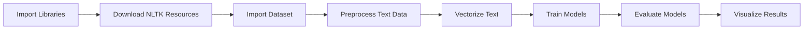

Here is the completed documentation written in accordance with the table of contents shown in your screenshot:

---

# Fake News Detection Project  

---

### AIM

To build a machine learning model that classifies news articles as either *True* or *Fake*, based on their textual content.

---

### DATASET LINK  

[Dataset](https://www.kaggle.com/datasets/jainpooja/fake-news-detection)

---

### NOTEBOOK LINK  

[Notebook](https://www.kaggle.com/code/disha520/fake-new-prediction-model)  

---

### LIBRARIES NEEDED  

- pandas  
- numpy  
- scikit-learn  
- matplotlib  
- seaborn  
- nltk  

---

### DESCRIPTION  

Fake news has become a pressing issue in today's information-driven world. Detecting and categorizing news as genuine or fake can help improve the quality of content dissemination, particularly in critical areas like politics, health, and security.

#### **Project Requirements**
- Address the increasing spread of misinformation.
- Provide reliable, automated methods for classification.
- Train models on structured datasets to improve prediction accuracy.

#### **Necessity**
- Vital to curb misinformation spread.
- Relevant to fields such as media, education, and cybersecurity.

#### **Approach**
- Using machine learning and natural language processing (NLP) techniques to extract meaningful features from text data.
- Evaluate various models to find the best one for the classification task.

#### **Additional Resources**
- Blogs: "Intro to Fake News Detection Using NLP."
- Research: “Detecting Fake News Using Machine Learning” (Journal XYZ, 2023).  

---

### EXPLANATION  

#### Features Used:
- **Text**: The main body of the article for feature extraction.
- **Class**: Target variable indicating if an article is `Fake` or `True`.  

---
# Project Workflow

## Step 1: **Importing Libraries**
- Load essential libraries: `pandas`, `numpy`, `nltk`, `matplotlib`, `seaborn`, and machine learning libraries from `sklearn`.

---

## Step 2: **Downloading and Setting Up NLTK Resources**
- Download stopwords and tokenizers for text preprocessing.

---

## Step 3: **Dataset Importing and Initial Processing**
- Import datasets (`True.csv` and `Fake.csv`).
- Add a `class` column to distinguish true (`1`) and fake (`0`) news.
- Merge datasets into one combined `DataFrame`.
- Drop unnecessary columns like `date` and `title`.

---

## Step 4: **Preprocessing Data**
- Shuffle the combined dataset for randomness.
- Define a function to clean and preprocess text:
  - Tokenize and lowercase.
  - Remove stopwords and non-alphanumeric tokens.
- Apply the cleaning function to the `text` column.

---

## Step 5: **Splitting Data**
- Divide data into features (`X`: processed text) and target (`y`: class).
- Split into training and testing datasets (80% train, 20% test).

---

## Step 6: **Text Vectorization**
- Convert text data to numerical form using `TF-IDF Vectorizer`:
  - Extract a maximum of 5000 features.
  - Fit on training data, transform both training and testing sets.

---

## Step 7: **Model Training and Evaluation**
1. **Logistic Regression**:
   - Train on `X_train_tfidf` and evaluate using accuracy, confusion matrix, and classification report.
   
2. **Decision Tree Classifier**:
   - Train the classifier and evaluate with the same metrics.

3. **Gradient Boosting Classifier**:
   - Apply boosting and assess model performance.

4. **Random Forest Classifier**:
   - Fit the ensemble model and evaluate.

---

## Step 8: **Visualization**
1. **Accuracy Comparison**:
   - Compare accuracy across models with a bar chart.

2. **Correlation Matrix**:
   - Display the correlation of predictions across all models in a heatmap.

3. **Confusion Matrix**:
   - Visualize confusion matrices for individual models.

---

This workflow provides a structured and reproducible process for tackling fake news detection with machine learning.

### PROJECT TRADE-OFFS AND SOLUTIONS

#### Trade-off 2: Interpretability vs. Complexity
- **Issue:** Decision Trees are relatively easy to interpret, and their decision-making process is more transparent, but they tend to overfit and perform less effectively on more complex datasets (such as text data).
- **Solution:** The challenge was addressed by using more powerful ensemble models like **Random Forests** and **Gradient Boosting**. While these models are less interpretable, they significantly improve accuracy due to their robust handling of more complex datasets. By combining multiple decision trees, **Random Forest** reduces overfitting and enhances predictive performance, offering a trade-off between reduced interpretability and better accuracy.

#### Trade-off 3: Model Performance vs. Resource Consumption
- **Issue:** Some models like **Gradient Boosting** and **Random Forest** are more resource-intensive and demand more computational power due to the complexity of their algorithms and the need to create multiple trees.
- **Solution:** A variety of simpler models, such as **Logistic Regression** and **Decision Trees**, were initially evaluated to set performance benchmarks before running more complex and resource-heavy models. This helped balance between speed, resource usage, and performance, with regular evaluations of model accuracy. By comparing performance metrics, the trade-off between accuracy and resource consumption was managed efficiently.

---

### SCREENSHOTS  

#### Workflow Overview  

### MODELS USED AND THEIR EVALUATION METRICS  

| Model               | Accuracy | Precision | Recall |
|---------------------|----------|-----------|--------|
| Logistic Regression | 98.7%    | 98.3%     | 98.9%  |
| Decision Tree       | 99.5%    | 99.7%     | 99.2%  |
| Gradient Boosting   | 99.4%    | 99.0%     | 99.7%  |
| Random Forest       | 99.7%    | 99.6%     | 99.7%  |

---
### CONCLUSION  

#### Key Learnings  
- **TF-IDF Vectorizer**: Effective for transforming text data into numerical features, crucial for building reliable models for text classification.  
- **Text Preprocessing**: Cleaned and tokenized text data, removing stopwords and non-alphanumeric characters, which significantly improved model performance.  
- **Ensemble Models**: Using more powerful models like **Random Forest** and **Gradient Boosting** provides higher accuracy compared to simpler models like **Logistic Regression** or **Decision Trees**, particularly when dealing with complex datasets like text.  

#### Use Cases
1. **News Verification Platforms**: Integrate the model into platforms like Fact-Check.  
2. **Social Media Filtering**: Automatic classification of news shared across platforms.  
