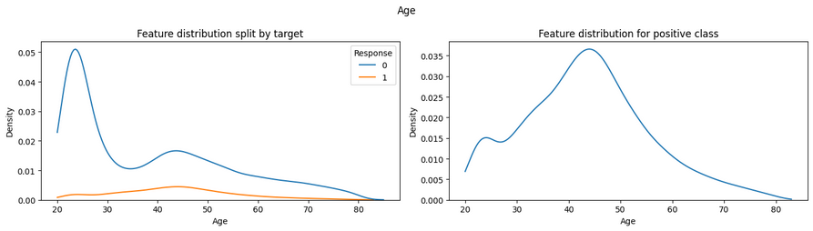
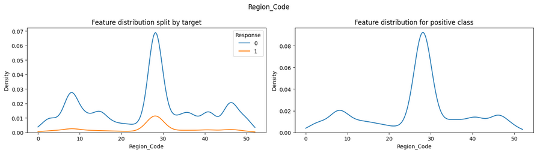
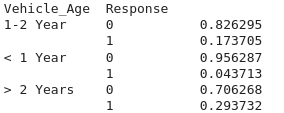
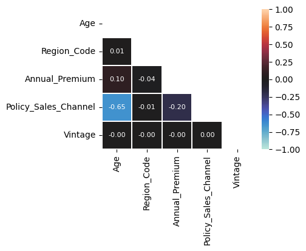
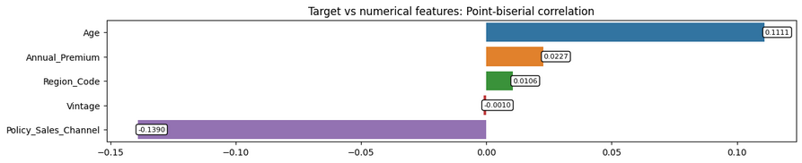
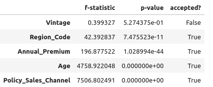
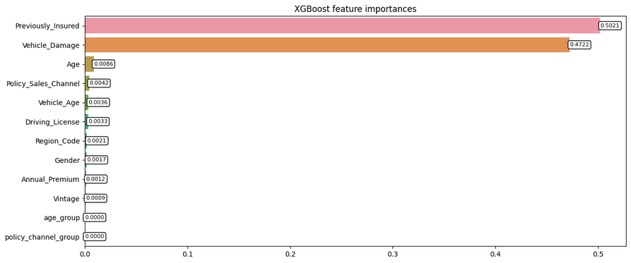

# Health Insurance Cross-sell Prediction

## AIM

To predict whether a Health Insurance customer would be interested in buying Vehicle Insurance.

## DATASET LINK

[Health Insurance Cross Sell Prediction Dataset - Kaggle](https://www.kaggle.com/datasets/anmolkumar/health-insurance-cross-sell-prediction)

## MY NOTEBOOK LINK

[Insurance Cross-sell Prediction: EDA + Modeling](https://www.kaggle.com/code/sid4ds/insurance-cross-sell-prediction-eda-modeling)

## DESCRIPTION

* Why is the project necessary?  
This project aims to predict the chances of cross-selling Vehicle insurance to existing Health insurance customers. This would be extremely helpful for companies because they can then accordingly plan communication strategy to reach out to those customers and optimise their business model and revenue.

* How did you start approaching this project? (Initial thoughts and planning)
  * Going through previous research and articles related to the problem.
  * Data exploration to understand the features. Using data visualization to check their distributions.
  * Identifying key metrics for the problem based on ratio of target classes - ROC-AUC & Matthew's Correlation Coefficient (MCC) instead of Accuracy.

* Mention any additional resources used (blogs, books, chapters, articles, research papers, etc.).
  * Feature Engineering: [Tutorial notebook](https://www.kaggle.com/code/milankalkenings/feature-engineering-tutorial)
  * Public notebook: [Vehicle Insurance EDA and boosting models](https://www.kaggle.com/code/yashvi/vehicle-insurance-eda-and-boosting-models)

## EXPLANATION

### DETAILS OF THE DIFFERENT FEATURES

1. id: numerical unique ID for the customer
2. Gender: binary gender of the customer
3. Age: numerical age of the customer
4. Driving_License: binary - 0: no DL, 1: has DL
5. Region_Code: numerical unique code for the region of the customer
6. Previously_Insured: binary - 1: already has Vehicle Insurance, 0: doesn't have Vehicle Insurance
7. Vehicle_Age: ordinal categorical age of the vehicle
8. Vehicle_Damage: binary - 1: vehicle damaged in the past, 0: vehicle not damaged in the past.
9. Annual_Premium: numerical amount to be paid as premium over the year
10. Policy_Sales_Channel: numerical anonymized code for the channel of outreaching to the customer ie. Different Agents, Over Mail, Over Phone, In Person, etc.
11. Vintage: numerical number of days the Customer has been associated with the company

### WHAT I HAVE DONE

1. **Exploratory Data Analysis**:
   * Summary statistics
   * Data visualization for numerical feature distributions
   * Target splits for categorical features
2. **Data cleaning and Preprocessing**:
   * Removing duplicates
   * Categorical feature encoding
3. **Feature engineering and selection**:
   * Discretizing numerical features
   * Feature selection based on model-based feature importances and statistical tests.
4. **Modeling**:
   * Holdout dataset created or model testing
   * Setting up a framework for easier testing of multiple models.
   * Models trained: Logistic Regression, Linear Discriminant Analysis, Quadratic Discriminant Analysis, Gaussian Naive-Bayes, Decision Tree, Random Forest, AdaBoost, Multi-Layer Perceptron, XGBoost, CatBoost, LightGBM
   * Class imbalance handled through:
      * class weights, when supported by model architecture
      * threshold tuning using TunedThresholdClassifierCV
   * Metric for model-tuning: F1-score (harmonic weighted mean of precision and recall)
5. **Result analysis**:
    * Predictions made on holdout test set
    * Models compared based on classification report and chosen metrics: ROC-AUC and MCC.

### PROJECT TRADE-OFFS AND SOLUTIONS

**Accuracy vs Recall & Precision**  
Data is heavily imbalanced, with only ~12% representing the positive class. This makes accuracy unsuitable as a metric for our problem. Our goal is to correctly predict all the positive samples, due to which we must focus on recall. However, this lowers the overall accuracy since some negative samples may be predicted as positive.

* **Solution**: Prediction threshold for models is tuned using F1-score to create a balance between precision and recall. This maintains overall accuracy at an acceptable level while boosting recall.

### LIBRARIES NEEDED

Libraries required for the project:

* pandas
* numpy
* scikit-learn (>=1.5.0 for TunedThresholdClassifierCV)
* xgboost
* catboost
* lightgbm
* matplotlib
* seaborn
* joblib

### SCREENSHOTS

**Feature distributions (Univariate analysis)**:  
  
  
  
  
  
  
  
  
  

**Engineered features**:  
  
  

**Bivariate analysis**:  
Pairplots:  
  
Spearman-rank correlation:  
  
Point-Biserial correlation:  
  
Tetrachoric correlation:  
  

**Feature selection**:  
Point-biserial correlation:  
  
ANOVA F-test:  
  
Tetrachoric correlation:  
  
Chi-squared test of independence:  
  
Mutual information:  
  
XGBoost feature importances:  
  
ExtraTrees feature importances:  

### MODELS USED AND THEIR PERFORMANCE

(best threshold after thresholdtuning is also mentioned)

| Model + Feature set | ROC-AUC | MCC | Best threshold |
|:-------|:----------:|:-----:|:-----:|
| Logistic Regression + Original | 0.8336 | 0.3671 | 0.65 |
| Logistic Regression + Extended | 0.8456 | 0.3821 | 0.66 |
| Logistic Regression + Reduced | 0.8455 | 0.3792 | 0.67 |
| Logistic Regression + Minimal | 0.8177 | 0.3507 | 0.60 |
| Linear DA + Original | 0.8326 | 0.3584 | 0.19 |
| Linear DA + Extended | 0.8423 | 0.3785 | 0.18 |
| Linear DA + Reduced | 0.8421 | 0.3768 | 0.18 |
| Linear DA + Minimal | 0.8185 | 0.3473 | 0.15 |
| Quadratic DA + Original | 0.8353 | 0.3779 | 0.45 |
| Quadratic DA + Extended | 0.8418 | 0.3793 | 0.54 |
| Quadratic DA + Reduced | 0.8422 | 0.3807 | 0.44 |
| Quadratic DA + Minimal | 0.8212 | 0.3587 | 0.28 |
| Gaussian Naive Bayes + Original | 0.8230 | 0.3879 | 0.78 |
| Gaussian Naive Bayes + Extended | 0.8242 | 0.3914 | 0.13 |
| Gaussian Naive Bayes + Reduced | 0.8240 | 0.3908 | 0.08 |
| Gaussian Naive Bayes + Minimal | 0.8055 | 0.3605 | 0.15 |
| K-Nearest Neighbors + Original | 0.7819 | 0.3461 | 0.09 |
| K-Nearest Neighbors + Extended | 0.7825 | 0.3469 | 0.09 |
| K-Nearest Neighbors + Reduced | 0.7710 | 0.3405 | 0.01 |
| K-Nearest Neighbors + Minimal | 0.7561 | 0.3201 | 0.01 |
| Decision Tree + Original | 0.8420 | 0.3925 | 0.67 |
| Decision Tree + Extended | 0.8420 | 0.3925 | 0.67 |
| Decision Tree + Reduced | 0.8419 | 0.3925 | 0.67 |
| Decision Tree + Minimal | 0.8262 | 0.3683 | 0.63 |
| Random Forest + Original | 0.8505 | 0.3824 | 0.70 |
| Random Forest + Extended | 0.8508 | 0.3832 | 0.70 |
| Random Forest + Reduced | 0.8508 | 0.3820 | 0.71 |
| Random Forest + Minimal | 0.8375 | 0.3721 | 0.66 |
| Extra-Trees + Original | 0.8459 | 0.3770 | 0.70 |
| Extra-Trees + Extended | 0.8504 | 0.3847 | 0.71 |
| Extra-Trees + Reduced | 0.8515 | 0.3836 | 0.72 |
| Extra-Trees + Minimal | 0.8337 | 0.3682 | 0.67 |
| AdaBoost + Original | 0.8394 | 0.3894 | 0.83 |
| AdaBoost + Extended | 0.8394 | 0.3894 | 0.83 |
| AdaBoost + Reduced | 0.8404 | 0.3839 | 0.84 |
| AdaBoost + Minimal | 0.8269 | 0.3643 | 0.86 |
| Multi-Layer Perceptron + Original | 0.8512 | 0.3899 | 0.22 |
| Multi-Layer Perceptron + Extended | 0.8528 | 0.3865 | 0.23 |
| Multi-Layer Perceptron + Reduced | 0.8517 | 0.3892 | 0.23 |
| Multi-Layer Perceptron + Minimal | 0.8365 | 0.3663 | 0.21 |
| XGBoost + Original | 0.8585 | 0.3980 | 0.68 |
| XGBoost + Extended | 0.8585 | 0.3980 | 0.68 |
| XGBoost + Reduced | 0.8584 | 0.3967 | 0.68 |
| XGBoost + Minimal | 0.8459 | 0.3765 | 0.66 |
| CatBoost + Original | 0.8579 | 0.3951 | 0.46 |
| CatBoost + Extended | 0.8578 | 0.3981 | 0.45 |
| CatBoost + Reduced | 0.8577 | 0.3975 | 0.45 |
| CatBoost + Minimal | 0.8449 | 0.3781 | 0.42 |
| LightGBM + Original | 0.8587 | 0.3978 | 0.67 |
| LightGBM + Extended | 0.8587 | 0.3976 | 0.67 |
| **LightGBM + Reduced** | **0.8587** | **0.3983** | 0.67 |
| LightGBM + Minimal | 0.8462 | 0.3753 | 0.66 |

## CONCLUSION

### WHAT YOU HAVE LEARNED

* Insights gained from the data:

1. *Previously_Insured*, *Vehicle_Damage*, *Policy_Sales_Channel* and *Age* are the most informative features for predicting cross-sell probability.
2. *Vintage* and *Driving_License* have no predictive power. They are not included in the best model.

* Improvements in understanding machine learning concepts:  

1. Implemented threshold-tuning for more accurate results.
2. Researched and utilized statistical tests for feature selection.

* Challenges faced and how they were overcome:

1. Shortlisting the apropriate statistical test for bivariate analysis and feature selection.
2. Deciding the correct metric for evaluation of models due to imbalanced nature of the dataset. F1-score was used for threshold-tuning. ROC-AUC score and MCC were used for model comparison.

### USE CASES OF THIS MODEL

Companies can use customer data to predict which customers to target for cross-sell marketing. This saves cost and effort for the company, and protects uninterested customers from unnecessary marketing calls.

### HOW TO INTEGRATE THIS MODEL IN REAL WORLD

* The model uses data based on customer data without any private identifiers.
* Since *Vintage* was eliminated from the feature set, even new customers can be analyzed through this model.
* Input data is preprocessed according to the steps taken before model training and the extended features are created.
* The best model: *LightGBM + Reduced-features* can be used for inference.
* Results on new data can be stored to monitor if the model maintains performance level. Once a significant number of new customers have been processed, system can be evaluated for model-drift and retrained if required.

### FEATURES PLANNED BUT NOT IMPLEMENTED

* Complex model-ensembling through stacking or hill-climbing was not implemented due to significantly longer training time.

### NAME

**Siddhant Tiwari**

#### Happy Coding 🧑‍💻

### Show some &nbsp;❤️&nbsp; by &nbsp;🌟&nbsp; this repository!
