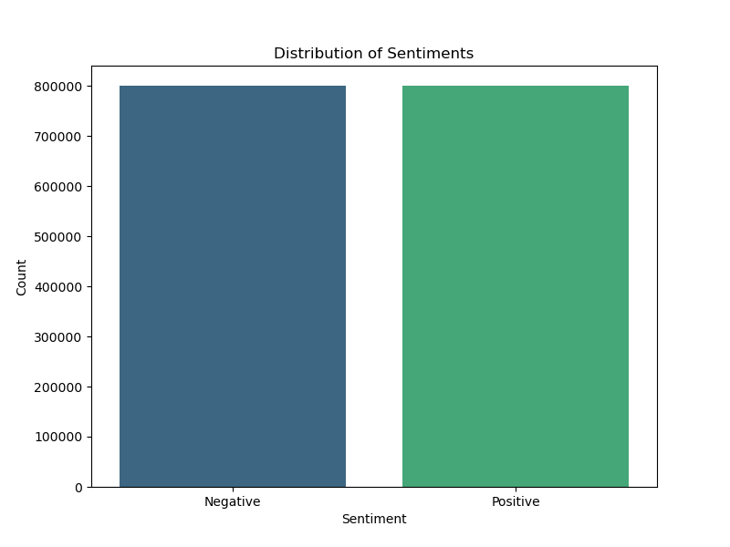

# Twitter Sentiment Analysis 

### AIM 
To analyze sentiment in Twitter data using natural language processing techniques.

### DATASET LINK 
[https://www.kaggle.com/datasets/kazanova/sentiment140](https://www.kaggle.com/datasets/kazanova/sentiment140)

### NOTEBOOK LINK 

[https://drive.google.com/drive/folders/1F6BLxvp6qIAgGZOZ2rC370EmKhj5W1FC?usp=sharing](https://drive.google.com/drive/folders/1F6BLxvp6qIAgGZOZ2rC370EmKhj5W1FC?usp=sharing)

### LIBRARIES NEEDED 

??? quote "LIBRARIES USED"

    - pandas
    - numpy
    - scikit-learn
    - seaborn
    - matplotlib
    - tensorflow
    - keras
    - nltk
    - multiprocessing
    - tqdm
    - os

--- 

### DESCRIPTION 

!!! info "What is the requirement of the project?"
    - The project aims to perform sentiment analysis on Twitter data.
    - This involves extracting tweets related to specific topics or keywords, processing these tweets using natural language processing (NLP) techniques to determine the sentiment (positive or negative), and presenting insights derived from the analysis.


??? info "Why is it necessary?"
    - Twitter is a rich source of real-time public opinion and sentiment. Analyzing tweets can provide valuable insights into public perception of events, products, brands, or topics of interest.
    - This information is crucial for businesses, governments, and researchers to make informed decisions, understand public sentiment trends, and gauge the success of marketing campaigns or policy changes.

??? info "How is it beneficial and used?"
    - Business Insights: Companies can understand customer feedback and sentiments towards their products or services.
    - Brand Management: Monitor brand sentiment and respond to customer concerns or issues in real-time.
    - Market Research: Identify trends and sentiments related to specific topics or industries.
    - Social Listening: Understand public opinion on current events, policies, or social issues.
    - Customer Service Improvement: Improve customer service by analyzing sentiment towards customer interactions.

??? info "How did you start approaching this project? (Initial thoughts and planning)"
    - Choose appropriate NLP techniques for sentiment analysis, such as:

        - Bag-of-Words (BoW) and TF-IDF: Represent tweets as numerical vectors.
        - Sentiment Lexicons: Use dictionaries of words annotated with sentiment scores (e.g., Vader sentiment lexicon).
        - Machine Learning Models: Train supervised classifiers (e.g., Naive Bayes, SVM, or neural networks) on labeled data for sentiment prediction.

    - Model Evaluation: Evaluate the performance of the sentiment analysis model using metrics like accuracy. Cross-validation techniques can be used to ensure robustness.

    - Visualization and Insights: Visualize sentiment trends over time or across different categories using charts (e.g., line plots, bar charts). Generate insights based on the analysis results.

    - Deployment: Deploy the sentiment analysis system as a standalone application or integrate it into existing systems for real-time monitoring and analysis.

??? info "Mention any additional resources used (blogs, books, chapters, articles, research papers, etc.)"
    - [GeeksforGeeks Twitter Sentiment Analysis](https://www.geeksforgeeks.org/twitter-sentiment-analysis-using-python/)
    - [YouTube Video](https://youtu.be/4YGkfAd2iXM?si=_COXzhlQG5a0z7PH)

--- 

### EXPLANATION

#### DETAILS OF THE DIFFERENT FEATURES 


--- 

#### WHAT I HAVE DONE 

=== "Step 1"

    Initial data exploration and understanding:

      - Gathered Twitter data using pre-existing datasets (Kaggle).
      - Understand the structure of the data (e.g., tweet text, metadata like timestamps, user information).
      - Explore basic statistics and distributions of data features.

=== "Step 2"

    Data cleaning and preprocessing:

      - Remove or handle noisy data such as URLs, special characters, and emojis.
      - Tokenize tweets into individual words or tokens.
      - Remove stopwords (commonly used words that do not carry significant meaning).
      - Normalize text through techniques like stemming to reduce variations of words.

=== "Step 3"

    Feature engineering and selection:

      - Convert text data into numerical representations suitable for machine learning models (e.g., Bag-of-Words, TF-IDF).
      - Select relevant features that contribute most to the sentiment analysis task.

=== "Step 4"

    Model training and evaluation:

      - Split the dataset into training and testing sets.
      - Choose appropriate machine learning models (e.g., Naive Bayes, RNN LSTM, logistic regression) for sentiment analysis.
      - Train the models on the training data and evaluate their performance using metrics like accuracy.

=== "Step 5"

    Model optimization and fine-tuning:

      - Fine-tune the hyperparameters of the selected models to improve performance.
      - Consider techniques like grid search or random search to find optimal parameters.
      - Experiment with different models or combinations of models to achieve better results.

=== "Step 6"

    Validation and testing:

      - Validate the trained models on a separate validation set to ensure generalizability.
      - Test the final model on unseen data (testing set or new tweets) to assess its performance in real-world scenarios.
      - Iterate on the model and preprocessing steps based on validation results to improve accuracy and robustness.

--- 

#### PROJECT TRADE-OFFS AND SOLUTIONS 

=== "Trade-off 1"

    Stemming process took a lot of computational time to process over 1.6 million datapoints.

      - **Solution**: Divided the data into batches and applied parallel processing.

=== "Trade-off 2"

    In RNN based LSTM, overfitting problem occurred.

      - **Solution**: Tried to fix it using Dropout layer, early stopping criteria.

--- 

### SCREENSHOTS 

!!! success "Project structure or tree diagram"

    ``` mermaid
      graph LR
      A[Start] --> B{Error?};
      B -->|Yes| C[Hmm...];
      C --> D[Debug];
      D --> B;
      B ---->|No| E[Yay!];
    ```

??? tip "Visualizations and EDA of different features"

    === "Sentiment Distribution"
        

??? example "Model performance graphs"

    === "LR Confusion Matrix"
        
    
    === "LR ROC Curve"
        
    
    === "Naive Bayes Confusion Matrix"
        
    
    === "Naive Bayes ROC Curve"
        

--- 

### MODELS USED AND THEIR EVALUATION METRICS 

| Model | Accuracy | MSE | R2 Score |
|-------|----------|-----|----------|
| Logistic Regression | 77% | 0.1531724703945824 | 0.3873101184216704 |
| Naive Bayes | 75% | 0.17476773790874897 | 0.3009290483650041 |
| RNN LSTM | 77.84% | - | - |

--- 

#### MODELS COMPARISON GRAPHS 

!!! tip "Models Comparison Graphs"

    === "LSTM Accuracy"
        
    === "LSTM Loss"
        

--- 

### CONCLUSION 

#### WHAT YOU HAVE LEARNED 

!!! tip "Insights gained from the data"
    - Data Variety: Twitter data provides a rich source of real-time, diverse opinions and sentiments.
    - Text Preprocessing: Importance of cleaning and preprocessing text data (e.g., removing stopwords, stemming/lemmatization) for better analysis.
    - Feature Extraction: Techniques like TF-IDF (Term Frequency-Inverse Document Frequency) and word embeddings (e.g., Word2Vec, GloVe) to represent text numerically for machine learning models.

??? tip "Improvements in understanding machine learning concepts"
    - Model Selection: Experimenting with various algorithms to find the most suitable for sentiment classification (e.g., logistic regression, naive bayes, neural networks).

??? tip "Challenges faced and how they were overcome"
    - Noise in Data: Dealing with noise from hashtags, emojis, and slang in tweets through effective preprocessing techniques.
    - Computational Resources: Managing large volumes of data and resource-intensive computations by optimizing code and leveraging cloud computing platforms if necessary.

--- 

#### USE CASES OF THIS MODEL

=== "Application 1"

    **Brand Monitoring and Customer Feedback Analysis**
    
      - This application allows businesses to leverage Twitter sentiment analysis as a valuable tool for customer relationship management, brand reputation management, and strategic decision-making based on real-time customer feedback and sentiment analysis.

=== "Application 2"

    **Financial Market Analysis and Investment Decisions**
    
      - This application showcases how Twitter sentiment analysis can be leveraged in the financial sector to gain competitive advantages, improve investment strategies, and manage risks effectively based on public sentiment towards financial markets and specific stocks.

--- 

### FEATURES PLANNED BUT NOT IMPLEMENTED 

=== "Feature 1"

    - Couldn't do it with SVM (Support Vector Machine) and Random Forest due to computational/system requirements.

--- 

### **DEVELOPER**
***Laya***

[LinkedIn](https://www.linkedin.com/in/laya-reddy-092911245){ .md-button }
[GitHub](https://www.github.com/devil-90){ .md-button }

##### Happy Coding 🧑‍💻
#### Show some &nbsp;❤️&nbsp; by &nbsp;🌟&nbsp; this repository!
