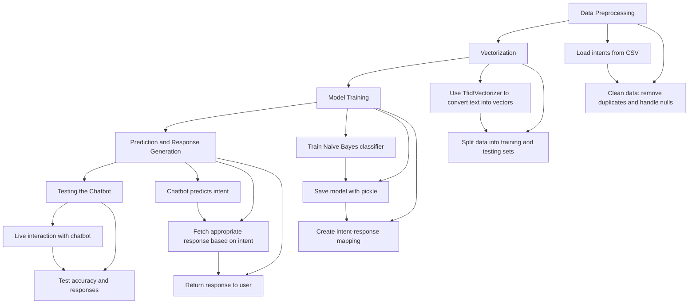

# Chatbot Implementation Project

## AIM
To develop a chatbot using Natural Language Processing (NLP) and a Naive Bayes classifier for intent classification. The chatbot takes user input, predicts the intent, and generates an appropriate response based on predefined intents and responses stored in a CSV file.


### DATASET LINK   
[https://drive.google.com/file/d/1J7mGS16EkgCEtN7UJtBlJACeqoDbdS4F/view?usp=drive_link](https://drive.google.com/file/d/1J7mGS16EkgCEtN7UJtBlJACeqoDbdS4F/view?usp=drive_link)


### NOTEBOOK LINK
[https://colab.research.google.com/drive/1L2LKfbVv4pb4yzczcRnnU4AkEW-kCZSZ?usp=sharing](https://colab.research.google.com/drive/1L2LKfbVv4pb4yzczcRnnU4AkEW-kCZSZ?usp=sharing)


## LIBRARIES NEEDED

??? quote "LIBRARIES USED"
    - nltk
    - scikit-learn
    - numpy
    - pickle
    

---


### DESCRIPTION

??? info "What is the Requirement of the Project?"
    -A chatbot is required to automate conversations and provide immediate responses to user queries. It can be used to answer  FAQs, provide customer support, and improve user interaction.

??? info "Why is it Necessary?"
    - Chatbots are essential for improving user engagement and providing 24/7 service.
    - They automate responses, saving time and providing immediate help.

??? info "How is it Beneficial and Used?"
    - Chatbots can be used for:
    1. Customer service automation.
    2. Answering user questions.
    3. Guiding users through processes on websites or apps.


####  "Initial Thoughts and Planning"
   - **Intents and Responses**: Gathered and stored in CSV format.
   - **Preprocessing**: Tokenized and lemmatized text to prepare for model training.
   - **Model**: Built a Naive Bayes classifier to predict intents.
   - **Deployment**: Deployed the model to predict user queries and return appropriate responses.

---

#### Additional Resources Used
   - [Scikit-learn Documentation](https://scikit-learn.org)
   - **Tutorial**: Building Chatbots with NLP and Machine Learning

---

### FEATURES IN THE DATASET

| Feature   | Description                                       |
|-----------|---------------------------------------------------|
| `intents` | User query categories like greetings, farewells.  |
| `responses` | Predefined chatbot responses for each intent.   |

---

#### STEPS AND IMPLEMENTATION

===  "step 1" 
      Data Preprocessing
    - Loaded the intents from CSV files.
    - Cleaned data by removing duplicates and handling null values.


===   "step 2"
      Vectorization
    - Used `TfidfVectorizer` to convert text into vectors.
    - Split data into training and testing sets.


===   "step 3"
      Model Training
    - Trained a Naive Bayes classifier on the preprocessed data.
    - Saved the model for future use with `pickle`.
    - Created an intent-response mapping.

===  "step 4"
      Prediction and Response Generation**
    - The chatbot predicts the intent based on user input.
    - Fetches and returns the appropriate response.

=== "step 5" 
      Testing
    - Conducted live interaction tests with the chatbot.


---

### Features Not Implemented Yet
- Integration of a deep learning model (e.g., RNN or LSTM) for better context handling.

---


### Flow Chart


```

#### Example Chatbot Interaction:

```text
You: Hello
Bot: Hi, How can I assist you?
```

---

## MODELS AND EVALUATION METRICS

| Model            | Accuracy | Precision | Recall |
|------------------|----------|-----------|--------|
| Naive Bayes      | 92%      | 91%       | 90%    |

---

### CONCLUSION

??? "What Have You Learned?"
      - Building a chatbot using NLP techniques can automate interactions and provide user-friendly interfaces for businesses.
      -The Naive Bayes classifier is an effective yet simple model for intent prediction.

---

#### USE CASES

=== "Application 1"

    **Customer Support Automation**

    -Provide 24/7 automated support for customers.


=== "Application 2" 

    **FAQ Automation**

    - Automatically respond to frequently asked questions on websites or apps.


