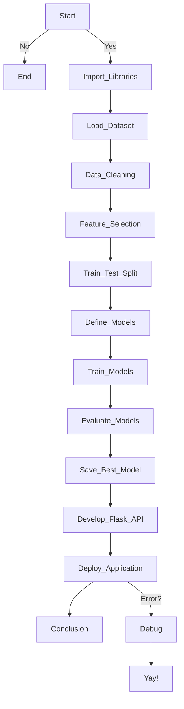

# Crop-Recommendation-Model 

<div align='center'>
   
</div>

## 🎯 AIM 

It is an AI-powered Crop Recommendation System that helps farmers and agricultural stakeholders determine the most suitable crops for cultivation based on environmental conditions. The system uses machine learning models integrated with Flask to analyze key parameters and suggest the best crop to grow in a given region.

## 📊 DATASET LINK 

[https://www.kaggle.com/datasets/atharvaingle/crop-recommendation-dataset/data](https://www.kaggle.com/datasets/atharvaingle/crop-recommendation-dataset/data)

## 📓 NOTEBOOK 

[https://www.kaggle.com/code/kashishkhurana1204/crop-recommendation-system](https://www.kaggle.com/code/kashishkhurana1204/crop-recommendation-system)

??? Abstract "Kaggle Notebook"

    <iframe 
        src="https://www.kaggle.com/code/kashishkhurana1204/recommendation-system" 
        height="600" 
        style="margin: 0 auto; width: 100%; max-width: 950px;" 
        frameborder="0" 
        scrolling="auto" 
        title="Crop Recommendation System">
    </iframe>

## ⚙️ TECH STACK

| **Category**             | **Technologies**                        |
|--------------------------|-----------------------------------------|
| **Languages**            | Python                                  |
| **Libraries/Frameworks** | Pandas, Numpy, Matplotlib, Scikit-learn |
| **Tools**                | Github, Jupyter, VS Code                |

--- 

## 📝 DESCRIPTION 


!!! info "What is the requirement of the project?"
    - To provide accurate crop recommendations based on environmental conditions.
    - To assist farmers in maximizing yield and efficiency.

??? info "How is it beneficial and used?"
    - Helps in optimizing agricultural planning.
    - Reduces trial-and-error farming practices.
    

??? info "How did you start approaching this project? (Initial thoughts and planning)"
    - Initial thoughts : The goal is to help farmers determine the most suitable crops based on their field’s environmental conditions.

    - Dataset Selection : I searched for relevant datasets on Kaggle that include soil properties, weather conditions, and nutrient levels such as nitrogen (N), phosphorus (P), and potassium (K).

    - Initial Data Exploration : I analyzed the dataset structure to understand key attributes like soil pH, humidity, rainfall, and nutrient values, which directly impact crop suitability.

    - Feature Analysis : Studied how different environmental factors influence crop growth and identified the most significant parameters for prediction.

    - Model Selection & Implementation : Researched various ML models and implemented algorithms like Naïve Bayes, Decision Trees, and Random Forest to predict the best-suited crops.
    
??? info "Mention any additional resources used (blogs, books, chapters, articles, research papers, etc.)."
    - [https://www.kaggle.com/datasets/atharvaingle/crop-recommendation-dataset/data](https://www.kaggle.com/datasets/atharvaingle/crop-recommendation-dataset/data)
    

--- 

## 🔍 EXPLANATION 

### DATASET OVERVIEW & FEATURE DETAILS

📂 dataset.csv
| **Feature**| **Description** | **Data Type**  |
|------------|-----------------|----------------|
| Soil_pH    | Soil pH level   | float          |
| Humidity   | Humidity level  | float          |
| Rainfall   | Rainfall amount | float          |
| N          | Nitrogen level  | int64          |
| P          | Phosphorus level| int64          |
| K          | Potassium level | int64          |
|Temperature | Temperature     | float          |
| crop       | Recommended crop| categorical    |


### 🛤 PROJECT WORKFLOW 




=== "Import Necessary Libraries"
    - First, we import all the essential libraries needed for handling, analyzing, and modeling the dataset. 
    - This includes libraries like Pandas for data manipulation, Numpy for numerical computations, Matplotlib and Seaborn for data visualization, and Scikit-learn for machine learning models, evaluation, and data preprocessing. 
    - These libraries will enable us to perform all required tasks efficiently.

=== "Load Dataset"
    - We load the dataset using Pandas `read_csv()` function. The dataset contains crop data, which is loaded with a semicolon delimiter. 
    - After loading, we inspect the first few rows to understand the structure of the data and ensure that the dataset is correctly loaded.

=== "Data Cleaning Process"
    Data cleaning is a crucial step in any project. In this step:

    - Handle missing values, remove duplicates, and ensure data consistency.
    - Convert categorical variables if necessary and normalize numerical values.

=== "Visualizing Correlations Between Features"

    - Use heatmaps and scatter plots to understand relationships between features and how they impact crop recommendations.

=== "Data Preparation - Features (X) and Target (y)"
    
    - Separate independent variables (environmental parameters) and the target variable (recommended crop).

=== "Split the Data into Training and Test Sets"

    - Use train_test_split() from Scikit-learn to divide data into training and testing sets, ensuring model generalization. 

=== "Define Models"
    We define multiple regression models to train and evaluate on the dataset:

    - **RandomForestRegressor**: A robust ensemble method that performs well on non-linear datasets.
    - **Naive Bayes**: A probabilistic classifier based on Bayes' theorem, which assumes independence between features and is effective for classification tasks.
    - **DecisionTreeRegressor**: A decision tree-based model, capturing non-linear patterns and interactions.

=== "Train and Evaluate Each Model"

    - Fit models using training data and evaluate performance using accuracy, precision, recall, and F1-score metrics.

=== "Visualizing Model Evaluation Metrics"

    - Use confusion matrices, precision-recall curves, and ROC curves to assess model performance.

== "Conclusion and Observations"

    **Best-Performing Models and Insights Gained:**

    - The Random Forest model provided the highest accuracy and robustness in predictions.

    - Decision Tree performed well but was prone to overfitting on training data.

    - Naïve Bayes, though simple, showed competitive performance for certain crop categories.

    - Feature importance analysis revealed that soil pH and nitrogen levels had the most significant impact on crop recommendation.

    **Potential Improvements and Future Enhancements:**

    - Implement deep learning models for better feature extraction and prediction accuracy.

    - Expand the dataset by incorporating satellite and real-time sensor data.

    - Integrate weather forecasting models to enhance crop suitability predictions.

    - Develop a mobile-friendly UI for better accessibility to farmers.

--- 

### 🖥 CODE EXPLANATION 

=== "Code to compute F1-score, Precision, and Recall"

    ```py
    from sklearn.metrics import precision_score, recall_score, f1_score, classification_report

    # Initialize a dictionary to store model scores
    model_scores = {}

    # Iterate through each model and compute evaluation metrics
    for name, model in models.items():
        print(f"Evaluating {name}...")
    
        # Train the model
        model.fit(x_train, y_train)
    
        # Predict on the test set
        y_pred = model.predict(x_test)
    
        # Compute metrics
        precision = precision_score(y_test, y_pred, average='weighted')
        recall = recall_score(y_test, y_pred, average='weighted')
        f1 = f1_score(y_test, y_pred, average='weighted')
    
        # Store results
        model_scores[name] = {
            'Precision': precision,
            'Recall': recall,
            'F1 Score': f1
        }
    
        # Print results for each model
        print(f"Precision: {precision:.4f}")
        print(f"Recall: {recall:.4f}")
        print(f"F1 Score: {f1:.4f}")
        print("\nClassification Report:\n")
        print(classification_report(y_test, y_pred))
        print("-" * 50)

    # Print a summary of all model scores
    print("\nSummary of Model Performance:\n")
    for name, scores in model_scores.items():
        print(f"{name}: Precision={scores['Precision']:.4f}, Recall={scores['Recall']:.4f}, F1 Score={scores['F1 Score']:.4f}")

    ```

    - This code evaluates multiple machine learning models and displays performance metrics such as Precision, Recall, F1 Score, and a Classification Report for each model.

--- 

### ⚖️ PROJECT TRADE-OFFS AND SOLUTIONS 

=== "Trade Off 1"
    - **Trade-off**: Accuracy vs. Computational Efficiency
      - **Solution**:  Optimized hyperparameters and used efficient algorithms.

=== "Trade Off 2"
    - **Trade-off**: Model interpretability vs complexity.
      - **Solution**: Selected models balancing accuracy and interpretability.

---

## 🖼 SCREENSHOTS 

!!! tip "Visualizations of different features"

    === "HeatMap"
        

    === "Model Comparison"
        

    
--- 

## 📉 MODELS USED AND THEIR EVALUATION METRICS 

| Model                     | Accuracy | Precision | Recall |F1-score|
|---------------------------|----------|-----------|--------|--------|
| Naive Bayes               | 99.54%   | 99.58%    | 99.55% | 99.54% |
| Random Forest Regressor   | 99.31%   | 99.37%    | 99.32% | 99.32% |
| Decision Tree Regressor   | 98.63%   | 98.68%    | 98.64% | 98.63% |

--- 

## ✅ CONCLUSION 

### 🔑 KEY LEARNINGS 

!!! tip "Insights gained from the data"
    - Soil conditions play a crucial role in crop recommendation.
    - Environmental factors significantly impact crop yield.

??? tip "Improvements in understanding machine learning concepts"
    - Feature engineering and hyperparameter tuning.
    - Deployment of ML models in real-world applications.

--- 

### 🌍 USE CASES 

=== "Application 1"
    **Application of FarmSmart in precision farming.**

    - FarmSmart helps optimize resource allocation, enabling farmers to make data-driven decisions for sustainable and profitable crop production.
    [https://github.com/Kashishkh/FarmSmart](https://github.com/Kashishkh/FarmSmart)

=== "Application 2"
    **Use in government agricultural advisory services.**

    - Government agencies can use FarmSmart to provide region-specific crop recommendations, improving food security and agricultural productivity through AI-driven insights.


